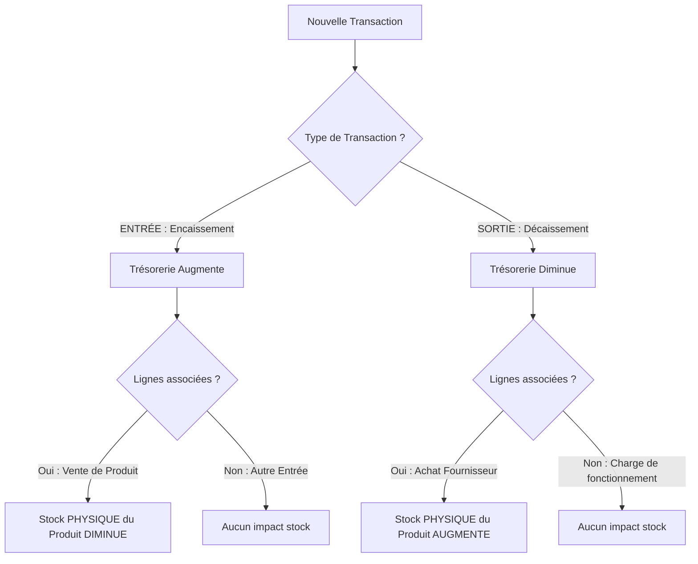

# Spécifications d'Architecture Produit & UI/UX : Cahier de Caisse Digital

Ce document définit les spécifications techniques et fonctionnelles pour l'intégration d'un module de **Cahier de Caisse Digital** au sein de l'application **Iventello**. Ce module assure la gestion unifiée des flux financiers (ventes et dépenses) et synchronise ces flux avec l'état réel des stocks de l'entreprise.

---

## 1. Architecture de la Base de Données (Modèle de Données)

Pour garantir une traçabilité totale et une intégrité parfaite des données financières et physiques, le modèle utilise une relation unifiée transactionnelle. 

### Schéma Prisma Proposé (SQLite)

Le schéma s'intègre harmonieusement avec la structure existante en introduisant deux modèles centraux : `CashTransaction` et `CashTransactionLine`.

```prisma
// Type de mouvement de caisse
enum TransactionType {
  ENTREE  // Encaissement : Vente, apport de capital, remboursement reçu
  SORTIE  // Décaissement : Achat de stock, loyer, électricité, salaires
}

// Modes de paiement adaptés aux commerces modernes
enum CashPaymentMethod {
  ESPECES
  CARTE_BANCAIRE
  MOBILE_MONEY // Très important pour le commerce de proximité (Wave, Orange, MTN, Moov)
  VIREMENT
}

model CashTransaction {
  id            String             @id @default(uuid())
  type          TransactionType
  totalAmount   Float              // Montant total net de la transaction
  paymentMethod CashPaymentMethod  // Mode de paiement utilisé
  description   String?            // Note ou motif (ex: "Facture électricité mai")
  userId        String?            // Traçabilité de l'utilisateur ayant saisi la transaction
  warehouseId   String             // Entrepôt dans lequel le stock est mouvementé
  createdAt     DateTime           @default(now())
  updatedAt     DateTime           @updatedAt

  // Relations
  warehouse     Warehouse          @relation(fields: [warehouseId], references: [id])
  lines         CashTransactionLine[]
}

model CashTransactionLine {
  id            String          @id @default(uuid())
  transactionId String
  productId     String
  quantity      Int             // Quantité concernée
  unitPrice     Float           // Prix unitaire appliqué lors de la transaction
  subTotal      Float           // Calculé : quantite * prix_unitaire

  // Relations
  transaction   CashTransaction @relation(fields: [transactionId], references: [id], onDelete: Cascade)
  product       Product         @relation(fields: [productId], references: [id])
}
```

> [!NOTE]
> Pour garder la compatibilité avec le système de mise en miroir SQL brut défini dans `src/main/index.ts` (comme indiqué dans `AGENTS.md`), toute modification du schéma Prisma doit être accompagnée de l'équivalent `CREATE TABLE IF NOT EXISTS` en SQL natif lors de l'initialisation de l'application Electron.

---

### Logique d'Impact Temporel et Physique sur le Stock

Le principe fondamental d'un ERP de boutique est le **double impact** d'une transaction financière sur les stocks physiques. Une transaction ne peut être validée sans que l'inventaire ne soit modifié en conséquence.



#### 1. Mécanisme de la Dépense (Achat de stock)
Lorsqu'un commerçant effectue une dépense de type **Achat de stock** (ex : 50 unités du Produit A à 10 €/unité) :
* **Flux Financier (Sortie) :** Le solde de caisse baisse de $500\ €$.
* **Flux Physique (Stock) :** Pour chaque produit de la ligne, la quantité disponible augmente :
  $$\text{Quantité Finale} = \text{Quantité Initiale} + \text{Quantité Achetée}$$
* **Code SQL de mise à jour (via Prisma) :**
  ```typescript
  prisma.stock.update({
    where: { productId_warehouseId: { productId, warehouseId } },
    data: { quantity: { increment: quantity } }
  });
  ```

#### 2. Mécanisme de la Vente (Encaissement)
Lorsqu'un client achète des articles (ex : 3 unités du Produit A à 15 €/unité) :
* **Flux Financier (Entrée) :** Le solde de caisse augmente de $45\ €$.
* **Flux Physique (Stock) :** La quantité disponible diminue :
  $$\text{Quantité Finale} = \text{Quantité Initiale} - \text{Quantité Vendue}$$
* **Code SQL de mise à jour (via Prisma) :**
  ```typescript
  prisma.stock.update({
    where: { productId_warehouseId: { productId, warehouseId } },
    data: { quantity: { decrement: quantity } }
  });
  ```

---

## 2. Composant Comptabilité en Temps Réel

Le tableau de bord de la caisse repose sur des indicateurs fiables, calculés de manière incrémentale à chaque mouvement.

### A. Formule du Solde de Caisse
Le solde représente la liquidité théorique disponible dans la caisse physique de la boutique pour la journée en cours.

$$\text{Solde Caisse} = \sum (\text{Montant}_{\text{Entrée}}) - \sum (\text{Montant}_{\text{Sortie}})$$

*Pour une robustesse maximale, les calculs sont effectués à l'aide de types décimaux ou convertis en centimes d'unités monétaires (Integer) pour éviter les approximations inhérentes aux nombres à virgule flottante en JavaScript.*

### B. Valeur du Stock Restant (Valorisation du Stock)
La valeur financière du stock représente le capital immobilisé dans les rayonnages et les entrepôts. Elle s'évalue au **prix d'achat de base** (coût de revient) des articles en stock, et non pas au prix de vente (pour ne pas anticiper de marge non réalisée).

$$\text{Valeur Totale du Stock} = \sum_{i=1}^{N} \left( \text{Quantité Disponible}_{i} \times \text{Prix d'Achat Unitaire}_{i} \right)$$

Où :
* $\text{Quantité Disponible}_{i}$ est la quantité globale ou par entrepôt du produit $i$.
* $\text{Prix d'Achat Unitaire}_{i}$ est la propriété `basePrice` du modèle `Product`.

### Exemple de Requête d'Agrégation Temps Réel (Prisma/SQLite)

```typescript
// Calcul des statistiques de caisse pour le jour J
export async function getRealTimeAccounting(warehouseId: string) {
  const startOfDay = new Date();
  startOfDay.setHours(0, 0, 0, 0);

  // 1. Somme des entrées et sorties du jour
  const transactions = await prisma.cashTransaction.findMany({
    where: {
      warehouseId,
      createdAt: { gte: startOfDay }
    },
    select: {
      type: true,
      totalAmount: true
    }
  });

  let totalEntrees = 0;
  let totalSorties = 0;

  transactions.forEach(t => {
    if (t.type === 'ENTREE') totalEntrees += t.totalAmount;
    else totalSorties += t.totalAmount;
  });

  const soldeDuJour = totalEntrees - totalSorties;

  // 2. Calcul de la valeur globale du stock restant
  const stocks = await prisma.stock.findMany({
    where: { warehouseId },
    include: { product: true }
  });

  const valeurTotaleStock = stocks.reduce((acc, current) => {
    return acc + (current.quantity * current.product.basePrice);
  }, 0);

  return {
    soldeDuJour,
    valeurTotaleStock,
    totalEntrees,
    totalSorties
  };
}
```

---

## 3. Interface Utilisateur (UI/UX) Premium & Mobile First

Le design est conçu selon les principes de l'**UI moderne haut de gamme** : structure en Bento Grid, cartes en verre dépoli (glassmorphism), typographies modernes sans-serif (ex: *Outfit* ou *Plus Jakarta Sans*), et micro-animations fluides de transition (Framer Motion).

```
+-----------------------------------------------------------------+
|   [CAHIER DE CAISSE]                             [ 31 Mai 2026 ]|
+-----------------------------------------------------------------+
|  +-----------------------------+  +--------------------------+  |
|  | Solde Caisse du Jour        |  | Valeur Totale du Stock   |  |
|  | 254 500 FCFA                |  | 4 820 000 FCFA           |  |
|  | [ +12.4% vs hier ]          |  | [ 1 240 articles ]       |  |
|  +-----------------------------+  +--------------------------+  |
+-----------------------------------------------------------------+
|  [ + NOUVELE TRANSACTION ]                 [ EXPORTER LE PDF ]  |
+-----------------------------------------------------------------+
|  JOURNAL DES FLUX (FIL CHRONOLOGIQUE)                           |
|  * [19:30] (->) Vente - Coca-Cola x3 .......... +1 500 FCFA [v] |
|  * [18:15] (<-) Achat - Pack Eau Minérale x10 . -5 000 FCFA [x] |
|  * [15:00] (<-) Charge - Loyer de la Boutique . -120 000 FCFA [x]|
+-----------------------------------------------------------------+
```

### A. Le Dashboard Bento Grid (Haut de page)

La disposition Bento Grid regroupe les informations clés de façon asymétrique mais harmonieuse.

*   **Carte Solde du Jour (Largeur 60%) :**
    *   *Visuel :* Fond dégradé subtil allant du vert émeraude doux (`#10b981`) au vert forêt foncé en mode sombre.
    *   *Indicateurs :* Montant géant avec symbole monétaire, indicateur de tendance en pourcentage (+X.X% par rapport à la veille) et répartition rapide en mini-graphique à barres (Entrées vs Sorties).
*   **Carte Valeur du Stock (Largeur 40%) :**
    *   *Visuel :* Fond ardoise minimaliste avec un effet miroir subtil.
    *   *Indicateurs :* Valeur marchande totale en devises, nombre total d'articles stockés en temps réel et badge de santé du stock (ex: "3 produits en alerte de rupture").

### B. Le Formulaire d'Ajout Rapide (Bottom Sheet Mobile / Drawer Shadcn)

Pour une utilisation à une main en boutique sur tablette ou smartphone, le formulaire utilise une **Bottom Sheet** qui glisse depuis le bas de l'écran avec une transition d'amorti fluide.

1.  **Sélecteur de Type de Flux :** Un sélecteur à deux onglets glissant (*Segmented Control*) :
    *   `[ Encaissement (Entrée) ]` en vert.
    *   `[ Décaissement (Sortie) ]` en rouge.
2.  **Sélection du Produit Multi-Modal :**
    *   Un champ de recherche intelligent auto-complété (Dropdown) avec saisie de texte.
    *   Un bouton raccourci déclenchant la caméra ou le scanner de codes-barres matériel (Wedge USB).
3.  **Contrôle de Quantité Anti-Erreur :**
    *   Un composant sélecteur numérique avec de grands boutons `[-]` et `[+]` tactiles.
    *   **Contrôle en Temps Réel :** Sous le sélecteur, un badge dynamique s'affiche.
        *   *En mode vente :* Affiche `"Stock disponible : 14 unités"`. Si l'utilisateur tente d'ajouter plus que 14, le bouton `[+]` se désactive automatiquement, le badge passe en rouge clignotant et affiche `"Stock insuffisant (Max : 14)"`. Cela évite la vente de produits non disponibles et garantit l'intégrité du stock.
        *   *En mode achat :* Affiche le stock actuel et projette le stock futur : `"Stock actuel : 14 -> Nouveau stock : 24"`.
4.  **Calculateur de Montant Dynamique :**
    *   Une ligne affichant la formule en temps réel : `Quantité × Prix unitaire = Montant Total`.
    *   Le prix unitaire est pré-rempli à partir de la fiche produit (`sellingPrice` pour une entrée, `basePrice` pour une sortie) mais reste éditable via un bouton cadenas de forçage (avec droits administrateurs requis).

```tsx
// Composant React d'un sélecteur de quantité anti-rupture
import React, { useState, useEffect } from 'react';
import { Minus, Plus, AlertTriangle, CheckCircle } from 'lucide-react';

interface QuantitySelectorProps {
  currentStock: number;
  unitPrice: number;
  type: 'ENTREE' | 'SORTIE';
  onChange: (qty: number, total: number) => void;
}

export const QuantitySelector: React.FC<QuantitySelectorProps> = ({
  currentStock,
  unitPrice,
  type,
  onChange
}) => {
  const [quantity, setQuantity] = useState(1);
  const isVente = type === 'ENTREE';
  const isOut = isVente && quantity > currentStock;

  useEffect(() => {
    onChange(quantity, quantity * unitPrice);
  }, [quantity, unitPrice, type]);

  const handleIncrement = () => {
    if (isVente && quantity >= currentStock) return;
    setQuantity(q => q + 1);
  };

  const handleDecrement = () => {
    if (quantity > 1) setQuantity(q => q - 1);
  };

  return (
    <div className="space-y-4 p-4 bg-slate-900/40 rounded-2xl border border-slate-800">
      <div className="flex items-center justify-between">
        <span className="text-sm text-slate-400 font-medium">Quantité</span>
        <div className="flex items-center space-x-3 bg-slate-950 p-1.5 rounded-full border border-slate-800">
          <button
            type="button"
            onClick={handleDecrement}
            className="p-2 rounded-full hover:bg-slate-800 text-slate-400 transition-colors"
          >
            <Minus size={16} />
          </button>
          <span className="w-12 text-center text-lg font-bold text-white">{quantity}</span>
          <button
            type="button"
            onClick={handleIncrement}
            disabled={isVente && quantity >= currentStock}
            className="p-2 rounded-full hover:bg-slate-800 text-slate-400 disabled:opacity-40 disabled:hover:bg-transparent transition-colors"
          >
            <Plus size={16} />
          </button>
        </div>
      </div>

      {/* Rétroaction Stock en Temps Réel */}
      <div className="flex items-center space-x-2 text-xs">
        {isVente ? (
          quantity >= currentStock ? (
            <span className="flex items-center text-amber-500 gap-1.5 font-semibold">
              <AlertTriangle size={14} /> Stock maximum atteint ({currentStock} max)
            </span>
          ) : (
            <span className="flex items-center text-emerald-500 gap-1.5 font-medium">
              <CheckCircle size={14} /> Stock restant après vente : {currentStock - quantity} unités
            </span>
          )
        ) : (
          <span className="flex items-center text-blue-400 gap-1.5 font-medium">
            <CheckCircle size={14} /> Stock projeté après réception : {currentStock + quantity} unités
          </span>
        )}
      </div>

      {/* Ligne de calcul financier */}
      <div className="pt-3 border-t border-slate-800 flex justify-between items-baseline">
        <span className="text-xs text-slate-500">Total : {quantity} × {unitPrice.toLocaleString()} FCFA</span>
        <span className="text-xl font-black text-emerald-400">{(quantity * unitPrice).toLocaleString()} FCFA</span>
      </div>
    </div>
  );
};
```

---

### C. Fil d'Actualité Chronologique Animé

Chaque transaction apparaît sous forme de carte interactive ordonnée du plus récent au plus ancien.

*   **Structure visuelle de la ligne :**
    *   `[Icône]` : Flèche diagonale verte pointant vers le haut-droit ($\nearrow$) pour les **Entrées** (ventes). Flèche diagonale rouge pointant vers le bas-droit ($\searrow$) pour les **Sorties** (dépenses).
    *   `[Détails]` : Nom du produit en gras (ou Titre de la dépense globale), heure de la transaction et type de paiement (badge stylisé "Espèces", "Wave", "Mobile Money").
    *   `[Quantité]` : Affichage de la quantité avec un badge coloré discret (ex: `+5` en bleu pour un achat de stock, `x2` en ardoise pour une vente).
    *   `[Prix Total]` : Montant en grand format coloré en fonction du type (`+15 000 FCFA` ou `-45 000 FCFA`).

---

## 4. Exportation PDF Professionnelle de la Caisse

L'exportation PDF est essentielle pour la comptabilité physique d'une boutique (archivage mensuel ou remise au comptable). Elle s'appuie sur le service `pdfkit` déjà disponible sur le processus principal (Main Process) d'Electron.

### Spécifications de la Mise en Page du PDF (Générateur PDFKit)

1.  **Format et Style de Page :** A4 Portrait, marges de 20 mm. Palette sobre : Bleu nuit pour les en-têtes de sections et gris neutre pour les bordures de tableaux.
2.  **En-tête Institutionnel :**
    *   Nom et logo de la boutique (chargé dynamiquement via `Warehouse.logoUrl`).
    *   Titre principal : **RAPPORT DE CAISSE JOURNALIER** (ou Périodique).
    *   Date de génération, nom de l'entrepôt et identité de l'opérateur.
3.  **Bloc de Résumé Bento (Répliqué sur le PDF) :**
    *   Trois encadrés alignés horizontalement contenant le **Solde de départ**, le **Volume des Ventes (+)**, le **Volume des Dépenses (-)** et le **Solde final de Caisse**.
4.  **Tableau Détaillé des Flux :**
    *   *Colonnes :* Heure | Type | Libellé / Produit | Quantité | Prix Unit. | Total | Mode de Paiement.
    *   *Alternance de lignes :* Lignes blanches et gris très clair pour faciliter la lecture.
5.  **Signature et Clôture :**
    *   Espace pour la signature de l'opérateur et du gérant de la boutique.

---

## 5. Gestion des Données Globale (Zustand Store)

Pour centraliser l'état global et propager instantanément les mises à jour comptables à travers toute l'application Electron sans latence, voici l'architecture du store Zustand pour le cahier de caisse :

```typescript
import { create } from 'zustand';
import { CashTransaction, Product } from '../../../shared/types';

interface CashRegisterState {
  transactions: CashTransaction[];
  soldeDuJour: number;
  valeurStock: number;
  isLoading: boolean;
  
  // Actions
  fetchDailyData: (warehouseId: string) => Promise<void>;
  addTransaction: (data: {
    type: 'ENTREE' | 'SORTIE';
    warehouseId: string;
    totalAmount: number;
    paymentMethod: string;
    description?: string;
    lines: { productId: string; quantity: number; unitPrice: number }[];
  }) => Promise<void>;
  exportPDF: (startDate: string, endDate: string) => Promise<string>;
}

export const useCashRegisterStore = create<CashRegisterState>((set, get) => ({
  transactions: [],
  soldeDuJour: 0,
  valeurStock: 0,
  isLoading: false,

  fetchDailyData: async (warehouseId) => {
    set({ isLoading: true });
    try {
      // Appels IPC vers le processus principal Electron
      const data = await window.api.getRealTimeAccounting(warehouseId);
      const transactions = await window.api.getCashTransactions(warehouseId);
      set({
        soldeDuJour: data.soldeDuJour,
        valeurStock: data.valeurTotaleStock,
        transactions,
        isLoading: false
      });
    } catch (error) {
      console.error("Erreur lors de la récupération des données de caisse :", error);
      set({ isLoading: false });
    }
  },

  addTransaction: async (data) => {
    try {
      // Enregistre la transaction et met à jour le stock en base de données de manière atomique
      await window.api.createCashTransaction(data);
      // Actualise le state local
      await get().fetchDailyData(data.warehouseId);
    } catch (error) {
      console.error("Erreur lors de l'enregistrement de la transaction :", error);
      throw error;
    }
  },

  exportPDF: async (startDate, endDate) => {
    return await window.api.exportCashReport({ startDate, endDate });
  }
}));
```

---

## 6. Synthèse des Bénéfices & Recommandations

Ce module apporte une valeur métier immense à la gestion de boutique :
*   **Protection contre la vente à perte et rupture de stock :** Grâce à l'indicateur de stock en temps réel dans le sélecteur de quantité.
*   **Comptabilité double entrée automatisée :** Chaque action de caisse produit automatiquement son équivalent physique (mouvement de stock) et son équivalent monétaire (ligne de trésorerie).
*   **Expérience fluide et moderne :** Le layout Bento Grid et la Bottom Sheet offrent une ergonomie digne des meilleures applications SaaS actuelles.
