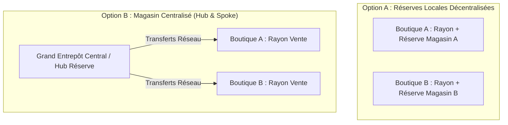

# CAHIER DE CONCEPTION TECHNIQUE : MODULE MULTI-BOUTIQUES & ÉTANCHÉITÉ DES DONNÉES
**Projet :** Iventello Enterprise 2.0  
**Version :** 2.0.0  
**Statut :** Validé / En cours d'implémentation  
**Auteur :** Architecte Logiciel Flutter & Systèmes Embarqués POS  

---

## 1. VISION & OBJECTIFS DU MODULE BOUTIQUE

Dans **Iventello 2.0**, une « Boutique » (ou Point de Vente / Entrepôt) constitue une **unité organisationnelle et opérationnelle autonome**.

### 1.1. Clarification Architecturale : Données Locales vs Données Réseau
Pour lever toute ambiguïté entre étanchéité opérationnelle et flexibilité commerciale :
1. **Données Opérationnelles & Transactionnelles (Étanchéité Locale Stricte - `shopId NOT NULL`) :**
   * Stocks physiques (`product_stocks`), Sessions de caisse (`cash_sessions`), Ventes et Tickets (`sales`), Lignes de vente (`sale_items`), Mouvements de stock (`stock_movements`), Journaux d'audit locaux (`audit_logs`).
   * *Règle :* Un terminal de caisse est strictement restreint à son `shopId` actif.
2. **Référentiels Partagés Réseau (`shopId NULLABLE`) :**
   * **Catalogue Produits (`products`) :** Fiches articles communes à toute l'entreprise.
   * **Fournisseurs Réseau (`suppliers.shopId = NULL`) :** Fournisseurs référencés pour tout le réseau, ou locaux si un `shopId` spécifique est assigné.
   * **Clients Réseau (`clients.shopId = NULL`) :** Comptes clients valables dans toutes les boutiques (fidélité globale), ou réservés à une boutique si `shopId` est précisé.

---

## 2. CONFIGURATION DE LA TOPOLOGIE DES MAGASINS (ONBOARDING WIZARD)

Lors de la première configuration de l'entreprise (ou dans les paramètres généraux de l'Administrateur), l'assistant d'onboarding propose le choix de la **Topologie Logistique des Magasins / Réserves** :



### 2.1. Option 1 : Magasin par Boutique (Décentralisé)
* Chaque point de vente dispose à la fois de son **espace de vente en rayon** (`quantityBoutique`), de ses **unités détachées** (`quantityUnitesDetachees`) et de son **arrière-boutique / réserve locale** (`quantityMagasin`).
* Les réassorts internes `Réserve ➔ Rayon` se font au sein du même point de vente sans bordereau de transport.

### 2.2. Option 2 : Magasin Unique Centralisé (*Hub & Spoke*)
* L'entreprise possède un **Entrepôt Central Unique** où toutes les marchandises fournisseurs sont réceptionnées.
* Les boutiques physiques sont des surfaces de vente en rayon (`quantityBoutique`).
* Tout approvisionnement passe par un **Transfert Inter-Boutique / Bon d'Expédition** émis depuis le Magasin Central vers la boutique destinataire.

---

## 3. COMPARATIF : VERSION ELECTRON VS IVENTELLO 2.0

| Aspect | Ancienne Version (Electron) | Nouvelle Version 2.0 (Natif Flutter / Rust) |
| :--- | :--- | :--- |
| **Topologie Logistique** | Non configurable (schéma rigide). | **Choix à l'Onboarding :** Magasin par boutique, Magasin Centralisé ou Hybride. |
| **Cloisonnement des Données** | Simple champ `warehouseId` partagé. | **Étanchéité stricte par `shop_id` + Filtrage FFI natif indexé.** Chaque caisse n'accède qu'à son propre périmètre. |
| **Transferts Inter-Boutiques** | Simples mouvements sans validation à l'arrivée. | **Workflow à double validation :** `BROUILLON` ➔ `EN_TRANSIT` ➔ `RECU_CONFORME` / `RECU_LITIGE` / `ANNULE`. |
| **Gestion des Droits (RBAC)** | Rôles globaux partagés. | **Permissions contextualisées par boutique :** Droits granulaires définis dans `user_shop_assignments`. |
| **Paramétrage Factures & Tickets** | Configuration partielle. | **Profil fiscal complet par boutique :** En-têtes ESC/POS, NUI, RCCM, logos et devises locales. |

---

## 4. MODÉLISATION DES DONNÉES (DRIFT SQLITE FFI)

### 4.1. Table de Configuration Entreprise (`company_settings`)
```dart
import 'package:drift/drift.dart';

class CompanySettings extends Table {
  TextColumn get id => text()(); // UUIDv7
  TextColumn get companyName => text()();
  
  // Topologie Logistique:
  // 'DECENTRALIZED' (Magasin par boutique) | 'CENTRALIZED' (Magasin Central Unique) | 'HYBRID'
  TextColumn get warehouseTopology => text().withDefault(const Constant('DECENTRALIZED'))();
  TextColumn get centralWarehouseShopId => text().nullable()();
  
  DateTimeColumn get updatedAt => dateTime().withDefault(currentDateAndTime)();

  @override
  Set<Column> get primaryKey => {id};
}
```

### 4.2. Table des Boutiques & Entrepôts (`shops`)
```dart
class Shops extends Table {
  TextColumn get id => text()(); // UUIDv7
  TextColumn get code => text().withLength(min: 2, max: 20).customConstraint('UNIQUE')(); // Ex: "BTQ-NORD"
  TextColumn get name => text().withLength(min: 1, max: 150)();
  TextColumn get address => text().nullable()();
  TextColumn get city => text().nullable()();
  TextColumn get phone => text().nullable()();
  TextColumn get email => text().nullable()();
  TextColumn get logoPath => text().nullable()();
  
  // Configuration Fiscale & Commerciale Locale
  TextColumn get taxRegistrationNumber => text().nullable()();
  TextColumn get tradeRegisterNumber => text().nullable()();
  RealColumn get defaultVatRate => real().withDefault(const Constant(19.25))();
  TextColumn get currencySymbol => text().withDefault(const Constant('FCFA'))();
  
  // En-têtes et Pieds de ticket thermique ESC/POS
  TextColumn get receiptHeader => text().nullable()();
  TextColumn get receiptFooter => text().nullable()();
  
  // Modules activés par boutique
  BoolColumn get isMobileMoneyEnabled => boolean().withDefault(const Constant(false))();
  BoolColumn get isCanalPlusEnabled => boolean().withDefault(const Constant(false))();
  BoolColumn get isBookstoreEnabled => boolean().withDefault(const Constant(false))();
  
  // Type: 'BOUTIQUE_VENTE' | 'ENTREPOT_CENTRAL' | 'POINT_RELAIS'
  TextColumn get type => text().withDefault(const Constant('BOUTIQUE_VENTE'))();
  BoolColumn get isActive => boolean().withDefault(const Constant(true))();

  // Traçabilité & Sync
  IntColumn get version => integer().withDefault(const Constant(1))();
  DateTimeColumn get updatedAt => dateTime().withDefault(currentDateAndTime)();
  DateTimeColumn get createdAt => dateTime().withDefault(currentDateAndTime)();
  BoolColumn get isDirty => boolean().withDefault(const Constant(false))();

  @override
  Set<Column> get primaryKey => {id};
}
```

### 4.3. Table des Affectations Utilisateurs / Boutiques (`user_shop_assignments`)
```dart
class UserShopAssignments extends Table {
  TextColumn get id => text()(); // UUIDv7
  TextColumn get userId => text()();
  TextColumn get shopId => text().references(Shops, #id, onDelete: KeyAction.cascade)();
  
  // Rôle: 'CAISSIER' | 'CHEF_RAYON' | 'GERANT_BOUTIQUE'
  TextColumn get role => text().withDefault(const Constant('CAISSIER'))();
  RealColumn get maxDiscountPercent => real().withDefault(const Constant(5.0))();
  
  BoolColumn get canOpenDrawerWithoutSale => boolean().withDefault(const Constant(false))();
  BoolColumn get canCancelTicket => boolean().withDefault(const Constant(false))();
  BoolColumn get canPerformInventory => boolean().withDefault(const Constant(false))();
  BoolColumn get canInitiateTransfer => boolean().withDefault(const Constant(false))();

  DateTimeColumn get createdAt => dateTime().withDefault(currentDateAndTime)();

  @override
  Set<Column> get primaryKey => {id};
  
  @override
  List<Set<Column>> get uniqueKeys => [
    {userId, shopId}
  ];
}
```

### 4.4. Table des Transferts Inter-Boutiques (`inter_shop_transfers`)
```dart
class InterShopTransfers extends Table {
  TextColumn get id => text()(); // UUIDv7
  TextColumn get transferNumber => text().customConstraint('UNIQUE')(); // Ex: "TRF-2026-0012"
  
  TextColumn get sourceShopId => text().references(Shops, #id)();
  TextColumn get targetShopId => text().references(Shops, #id)();
  
  // Statut Unifié Strict:
  // 'BROUILLON' | 'EN_TRANSIT' | 'RECU_CONFORME' | 'RECU_LITIGE' | 'ANNULE'
  TextColumn get status => text().withDefault(const Constant('BROUILLON'))();
  
  TextColumn get createdByUserId => text()();
  TextColumn get receivedByUserId => text().nullable()();
  
  DateTimeColumn get shippedAt => dateTime().nullable()();
  DateTimeColumn get receivedAt => dateTime().nullable()();
  
  TextColumn get notes => text().nullable()();
  TextColumn get disputeReason => text().nullable()();

  DateTimeColumn get createdAt => dateTime().withDefault(currentDateAndTime)();
  DateTimeColumn get updatedAt => dateTime().withDefault(currentDateAndTime)();
  BoolColumn get isDirty => boolean().withDefault(const Constant(false))();

  @override
  Set<Column> get primaryKey => {id};
}
```

### 4.5. Lignes de Transfert (`inter_shop_transfer_items`)
```dart
class InterShopTransferItems extends Table {
  TextColumn get id => text()(); // UUIDv7
  TextColumn get transferId => text().references(InterShopTransfers, #id, onDelete: KeyAction.cascade)();
  TextColumn get productId => text()();
  
  IntColumn get quantityShipped => integer()();
  IntColumn get quantityReceived => integer().nullable()();
  IntColumn get unitCostCents => integer()();

  @override
  Set<Column> get primaryKey => {id};
}
```

---

## 5. RÈGLES MÉTIER ET WORKFLOW DES TRANSFERTS

### 5.1. Workflow Unifié des Transferts

```text
[Boutique A - Source]                     [Boutique B - Destinataire]
        |                                              |
1. Création Transfert (TRF-001)                        |
   - Sélection Produits & Quantités                    |
   - Statut: "BROUILLON"                               |
        |                                              |
2. Validation Expédition                               |
   - Décrémentation immédiate du stock Boutique A      |
   - Création StockMovement(type: TRANSFERT_SORTANT)   |
   - Statut: "EN_TRANSIT"                              |
        |--------------------------------------------->|
                                                3. Réception Physique & Pointage
                                                   - Pointage au lecteur code-barres
                                                   - Si Quantité Reçue == Quantité Envoyée :
                                                       Statut: "RECU_CONFORME"
                                                   - Si Écart détecté (manquant/casse) :
                                                       Statut: "RECU_LITIGE" (Tracé d'incident)
                                                   - Incrémentation du stock Boutique B
                                                   - Création StockMovement(type: TRANSFERT_ENTRANT)
```
