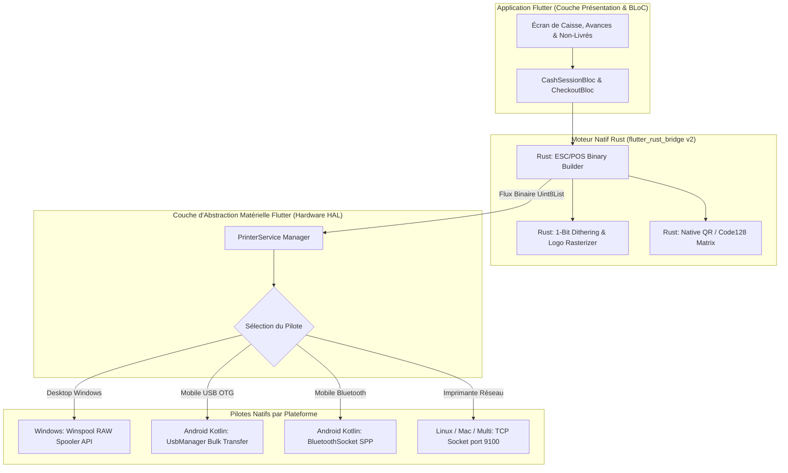
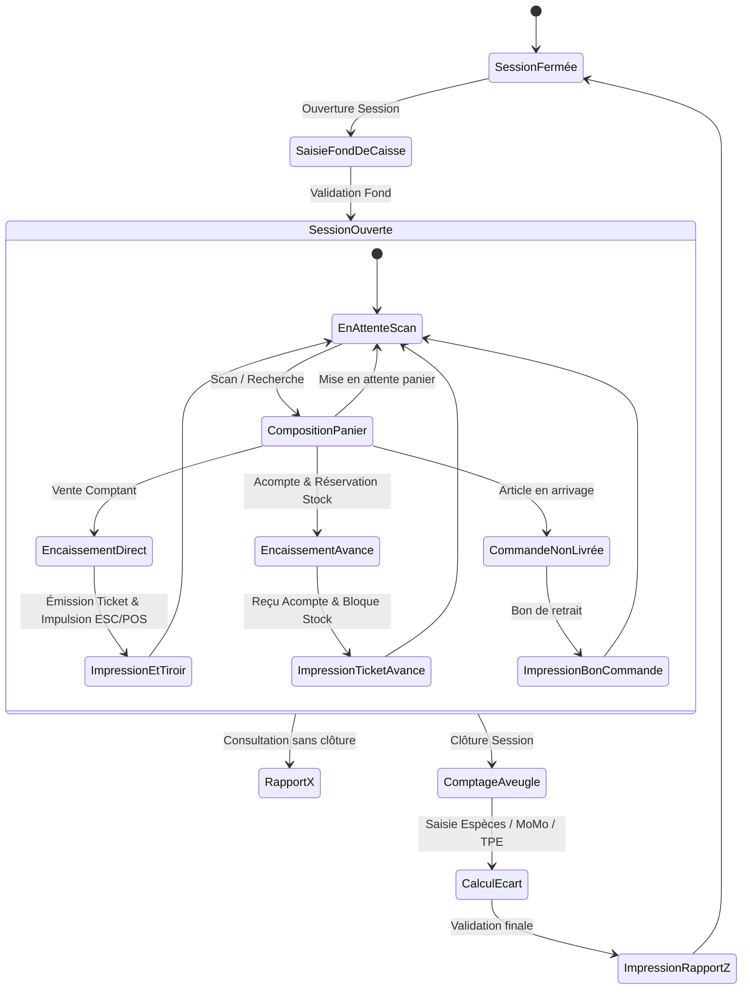

# CAHIER DE CONCEPTION TECHNIQUE : MODULE CAISSE (POS), MATÉRIEL & IMPRESSION NATIVE
**Projet :** Iventello Enterprise 2.0  
**Version :** 2.0.0  
**Statut :** Validé / En cours d'implémentation  
**Auteur :** Architecte Logiciel Flutter, Rust & Systèmes Embarqués POS  

---

## 1. VISION & OBJECTIFS DU MODULE CAISSE & IMPRESSION

Le module **Caisse & Matériel** constitue le cœur opérationnel de **Iventello 2.0**. Il est conçu pour une exécution **temps réel à très haute disponibilité (zéro crash, zéro blocage de file d'attente)** et interagit directement avec le matériel périphérique sans aucune dépendance web ou DOM.

### Objectifs Clés :
1. **Performance d'encaissement instantanée :** Ajout d'article, calcul de remises/taxes et validation de ticket en **< 3 ms**.
2. **Gestion des Avances sur Produit & Réservations :** Encaissement d'un acompte partiel avec blocage physique immédiat en `quantityReservee` (le produit est mis de côté et ne peut être vendu à un tiers).
3. **Gestion des Commandes Non Livrées (Arrivages futurs) :** Enregistrement d'articles hors-stock en attente de livraison fournisseur (`isPendingDelivery = true`), suivi des statuts (`NON_LIVRE` ➔ `DISPONIBLE` ➔ `LIVRE`) et émission de bons de retrait.
4. **Moteur d'Impression Hybride Natif :**
   * **Moteur Binaire Rust :** Génération et compression ultra-rapide des flux binaires ESC/POS (textes formatés, logos 1-bit rasterisés, codes QR, code-barres Code 128).
   * **Pilote Natif Windows (Winspool API / C++) :** Envoi en mode RAW direct au spooler d'impression Windows sans passer par les lourdeurs de pilotes graphiques GDI/XPS.
   * **Pilote Natif Android (Kotlin / Java) :** Gestion de l'USB Host (`UsbManager.bulkTransfer`) et du Bluetooth thermique mobile (SPP / BLE).
   * **Pilote Réseau (Raw TCP Sockets) :** Impression Ethernet / Wi-Fi universelle sur le port standard `9100`.
5. **Pilotage du Tiroir-Caisse & Périphériques :** Émission d'impulsions électriques RJ11 (`ESC p`) et gestion d'afficheurs clients (VFD).
6. **Gestion Rigoureuse des Sessions de Caisse :** Fond de caisse, comptage à l'aveugle, calcul automatique des écarts, Rapports intermédiaires X et Clôtures définitives Z.

---

## 2. ARCHITECTURE TECHNIQUE DU SYSTÈME MATÉRIEL



---

## 3. GESTION SPÉCIFIQUE DES AVANCES ET COMMANDES NON LIVRÉES

### 3.1. Avances sur Produits avec Réservation de Stock
Lorsqu'un client réserve un article disponible en boutique en versant un acompte :
1. **Validation Financière :** Le montant de l'avance est encaissé dans la session de caisse en cours (`depositAmountCents`).
2. **Impact Physique Stock :** La quantité demandée est transférée du stock disponible en rayon vers le stock réservé :
   $$\text{quantityBoutique} = \text{quantityBoutique} - Q$$
   $$\text{quantityReservee} = \text{quantityReservee} + Q$$
3. **Reçu Thermique d'Acompte :** Impression d'un ticket avec solde restant dû et numéro d'avance.
4. **Déblocage / Retrait Final :** Lors du versement du solde :
   * Encaissement du complément financier.
   * Décrémentation de `quantityReservee` de $Q$.
   * Création d'un mouvement définitif `StockMovement(type: VENTE_RETRAIT_AVANCE)`.

### 3.2. Commandes d'Articles Non Livrés (En attente d'arrivage)
Pour les articles temporairement en rupture mais en cours d'approvisionnement fournisseur :
1. **Enregistrement :** Création d'une vente marquée `isPendingDelivery = true` avec statut `deliveryStatus = 'NON_LIVRE'`.
2. **Réception de la marchandise :** Dès que le bon de livraison fournisseur est pointé, le système alerte la caisse des commandes clients en attente.
3. **Notification Client :** Statut passe à `'DISPONIBLE'` avec déclenchement de notification SMS/WhatsApp.
4. **Remise Marchandise :** Validation du bon de retrait par le client, le statut passe à `'LIVRE'`.

---

## 4. SCHÉMA DE DONNÉES DE LA CAISSE (DRIFT SQLITE FFI)

### 4.1. Table des Sessions de Caisse (`cash_sessions`)
```dart
import 'package:drift/drift.dart';

class CashSessions extends Table {
  TextColumn get id => text()(); // UUIDv7
  TextColumn get shopId => text()(); // Rattaché à la boutique
  TextColumn get cashierId => text()(); // Utilisateur responsable
  
  // Horodatages
  DateTimeColumn get openedAt => dateTime().withDefault(currentDateAndTime)();
  DateTimeColumn get closedAt => dateTime().nullable()();
  
  // Statut: 'OUVERTE' | 'CLOTUREE'
  TextColumn get status => text().withDefault(const Constant('OUVERTE'))();
  
  // Montants en Centimes
  IntColumn get openingAmountCents => integer().withDefault(const Constant(0))(); // Fond initial
  IntColumn get closingAmountExpectedCents => integer().nullable()(); // Théorique
  IntColumn get closingAmountActualCents => integer().nullable()();   // Compté à l'aveugle
  IntColumn get differenceCents => integer().nullable()();           // Écart
  
  // Totaux cumulés
  IntColumn get totalSalesCents => integer().withDefault(const Constant(0))();
  IntColumn get totalDepositsCents => integer().withDefault(const Constant(0))(); // Avances encaissées
  IntColumn get totalCashInCents => integer().withDefault(const Constant(0))();
  IntColumn get totalCashOutCents => integer().withDefault(const Constant(0))();
  IntColumn get totalMobileMoneyCents => integer().withDefault(const Constant(0))();
  IntColumn get totalCardCents => integer().withDefault(const Constant(0))();
  IntColumn get totalCreditSalesCents => integer().withDefault(const Constant(0))();
  
  TextColumn get notes => text().nullable()();
  
  IntColumn get version => integer().withDefault(const Constant(1))();
  DateTimeColumn get updatedAt => dateTime().withDefault(currentDateAndTime)();
  BoolColumn get isDirty => boolean().withDefault(const Constant(false))();

  @override
  Set<Column> get primaryKey => {id};
}
```

### 4.2. Table des Ventes & Réservations (`sales`)
```dart
class Sales extends Table {
  TextColumn get id => text()(); // UUIDv7
  TextColumn get shopId => text()();
  TextColumn get sessionId => text().references(CashSessions, #id)();
  TextColumn get invoiceNumber => text().customConstraint('UNIQUE')(); // Ex: "FAC-2026-0045"
  
  TextColumn get clientId => text().nullable()();
  TextColumn get cashierId => text()();
  
  // Montants Financiers Globaux (en centimes)
  IntColumn get subTotalCents => integer()();
  IntColumn get vatTotalCents => integer().withDefault(const Constant(0))();
  IntColumn get discountTotalCents => integer().withDefault(const Constant(0))();
  IntColumn get finalTotalCents => integer()();
  
  // Gestion des Avances & Crédits
  IntColumn get depositAmountCents => integer().nullable()(); // Montant de l'acompte versé
  IntColumn get remainingBalanceCents => integer().withDefault(const Constant(0))(); // Reste à payer
  
  // Règlements
  IntColumn get paidAmountCents => integer()();
  IntColumn get changeReturnedCents => integer().withDefault(const Constant(0))();
  
  // Mode: 'ESPECES' | 'MOBILE_MONEY' | 'CARTE' | 'CREDIT' | 'AVANCE' | 'MIXTE'
  TextColumn get paymentMethod => text()();
  TextColumn get paymentReference => text().nullable()();
  
  // Statut Vente: 'EN_ATTENTE' | 'VALIDE' | 'SOLDE' | 'ANNULE'
  TextColumn get status => text().withDefault(const Constant('VALIDE'))();
  
  // Gestion des Commandes Non Livrées
  BoolColumn get isPendingDelivery => boolean().withDefault(const Constant(false))();
  TextColumn get deliveryStatus => text().nullable()(); // 'NON_LIVRE' | 'DISPONIBLE' | 'LIVRE'
  DateTimeColumn get notifiedAt => dateTime().nullable()();
  
  DateTimeColumn get validatedAt => dateTime().nullable()();
  DateTimeColumn get createdAt => dateTime().withDefault(currentDateAndTime)();
  BoolColumn get isDirty => boolean().withDefault(const Constant(false))();

  @override
  Set<Column> get primaryKey => {id};
}
```

### 4.3. Table des Lignes de Vente (`sale_items`)
```dart
class SaleItems extends Table {
  TextColumn get id => text()(); // UUIDv7
  TextColumn get saleId => text().references(Sales, #id, onDelete: KeyAction.cascade)();
  TextColumn get productId => text()();
  
  TextColumn get productName => text()();
  TextColumn get barcode => text().nullable()();
  
  IntColumn get quantity => integer()();
  IntColumn get unitPriceCents => integer()();
  IntColumn get subTotalCents => integer()();
  IntColumn get discountCents => integer().withDefault(const Constant(0))();
  
  BoolColumn get wasDetachedFromPacket => boolean().withDefault(const Constant(false))();

  @override
  Set<Column> get primaryKey => {id};
}
```

---

## 5. PROCESSUS ET RÈGLES DE GESTION DE CAISSE

### 5.1. Cycle d'une Session de Caisse


### 5.2. Règle du Comptage à l'Aveugle (Rapport Z)
1. Le caissier clique sur « Clôturer la caisse ».
2. L'écran **ne dévoile pas** le montant théorique attendu.
3. Le caissier saisit la quantité de chaque billet et pièce ainsi que les totaux des bordereaux Mobile Money et TPE.
4. L'application calcule instantanément l'écart :
   $$\text{Écart} = \text{Montant Compté Physique} - (\text{Fond Initial} + \text{Ventes Espèces} + \text{Avances Encaissées} + \text{Entrées Diverses} - \text{Sorties})$$
5. Le Rapport Z est immédiatement imprimé sur l'imprimante thermique et archivé dans la base SQLite locale.
