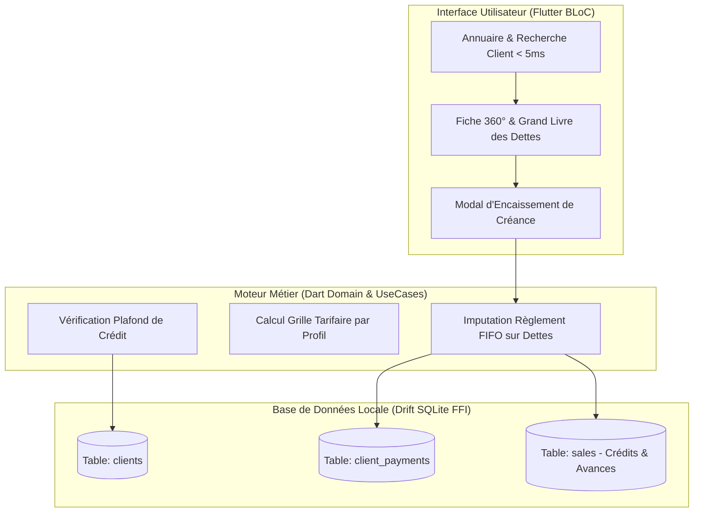

# CAHIER DE CONCEPTION TECHNIQUE : MODULE CLIENTS, CRÉDITS & ENCOURS
**Projet :** Iventello Enterprise 2.0  
**Version :** 2.0.0  
**Statut :** Validé / En cours d'implémentation  
**Auteur :** Architecte Logiciel Flutter, Rust & Systèmes Embarqués POS  

---

## 1. VISION & OBJECTIFS DU MODULE CLIENTS

Le module **Clients & Crédits** apporte un suivi commercial et financier de précision à **Iventello 2.0**. Il gère la fidélisation, les grilles tarifaires différenciées (Détail, Demi-Gros, Gros) et permet de sécuriser les ventes à terme (crédit client) et le suivi des acomptes.

### 1.1. Portée des Comptes Clients : Réseau vs Boutique Exclusive
* **Client Réseau (`shopId = NULL`) :** Compte client partagé entre tous les points de vente de l'entreprise. Le client peut acheter, utiliser ses remises de fidélité ou régler ses dettes dans n'importe quelle boutique de la chaîne.
* **Client Local Exclusif (`shopId` renseigné) :** Compte client créé et réservé à une boutique physique spécifique (ex: clients professionnels locaux).

---

## 2. ARCHITECTURE TECHNIQUE DU MODULE



---

## 3. MODÉLISATION DES DONNÉES (DRIFT SQLITE FFI)

### 3.1. Table des Clients (`clients`)
```dart
import 'package:drift/drift.dart';

class Clients extends Table {
  TextColumn get id => text()(); // UUIDv7
  
  // Null = Client Réseau partagé | Non-Null = Client exclusif à cette boutique
  TextColumn get shopId => text().nullable()(); 
  
  // Identité & Contact
  TextColumn get name => text().withLength(min: 1, max: 200)();
  TextColumn get phone => text().nullable().customConstraint('UNIQUE')();
  TextColumn get email => text().nullable()();
  TextColumn get address => text().nullable()();
  TextColumn get taxNumber => text().nullable()(); // NUI / NIF (pour clients professionnels)
  
  // Profil Commercial & Tarification
  // 'STANDARD' | 'FIDELE' | 'DEMI_GROS' | 'GROSSISTE' | 'VIP'
  TextColumn get category => text().withDefault(const Constant('STANDARD'))();
  RealColumn get defaultDiscountPercent => real().withDefault(const Constant(0.0))();
  
  // Encours & Gestion du Risque Financier (en Centimes)
  IntColumn get creditLimitCents => integer().withDefault(const Constant(0))(); // Plafond maximal autorisé (0 = aucun crédit)
  IntColumn get currentDebtCents => integer().withDefault(const Constant(0))();  // Dette cumulée actuelle
  IntColumn get totalSpentCents => integer().withDefault(const Constant(0))();   // Chiffre d'affaires historique généré
  
  // Points de Fidélité
  IntColumn get loyaltyPoints => integer().withDefault(const Constant(0))();
  
  TextColumn get notes => text().nullable()();
  BoolColumn get isActive => boolean().withDefault(const Constant(true))();

  // Traçabilité & Sync
  IntColumn get version => integer().withDefault(const Constant(1))();
  DateTimeColumn get createdAt => dateTime().withDefault(currentDateAndTime)();
  DateTimeColumn get updatedAt => dateTime().withDefault(currentDateAndTime)();
  DateTimeColumn get deletedAt => dateTime().nullable()();
  BoolColumn get isDirty => boolean().withDefault(const Constant(false))();

  @override
  Set<Column> get primaryKey => {id};
}
```

### 3.2. Table des Règlements de Créances (`client_payments`)
Enregistre chaque encaissement venant épurer les dettes d'un client.

```dart
class ClientPayments extends Table {
  TextColumn get id => text()(); // UUIDv7
  TextColumn get shopId => text()(); // Boutique où le règlement a été encaissé
  TextColumn get clientId => text().references(Clients, #id)();
  TextColumn get cashierId => text()();
  TextColumn get receiptNumber => text().customConstraint('UNIQUE')(); // Ex: "RC-2026-0089"
  
  // Montant encaissé (en centimes)
  IntColumn get amountCents => integer()();
  
  // Mode: 'ESPECES' | 'MOBILE_MONEY' | 'CARTE' | 'VIREMENT' | 'CHEQUE'
  TextColumn get paymentMethod => text()();
  TextColumn get paymentReference => text().nullable()(); // Référence MoMo / N° Chèque
  
  TextColumn get notes => text().nullable()();
  
  DateTimeColumn get paymentDate => dateTime().withDefault(currentDateAndTime)();
  DateTimeColumn get createdAt => dateTime().withDefault(currentDateAndTime)();
  BoolColumn get isDirty => boolean().withDefault(const Constant(false))();

  @override
  Set<Column> get primaryKey => {id};
}
```

---

## 4. PROCESSUS MÉTIER ET RÈGLES DE GESTION

### 4.1. Règle de Vente à Crédit en Caisse
Lorsqu'un caissier valide un ticket avec le mode de paiement `CREDIT` :

```text
SI client.creditLimitCents == 0 ALORS
    Interdire la vente: "Ce client n'a pas d'autorisation de crédit."
SINON
    nouveau_total_dette = client.currentDebtCents + montant_vente_cents
    SI nouveau_total_dette > client.creditLimitCents ALORS
        Afficher modale d'autorisation:
        "Dépassement du plafond de crédit autorisé. Saisir PIN Gérant pour débloquer."
        SI PIN_Valide ALORS
            Enregistrer Vente(status: 'VALIDE', paymentMethod: 'CREDIT')
            client.currentDebtCents = nouveau_total_dette
            Inscrire au journal d'audit
        SINON
            Bloquer la validation
        FIN SI
    SINON
        Enregistrer Vente(status: 'VALIDE', paymentMethod: 'CREDIT')
        client.currentDebtCents = nouveau_total_dette
    FIN SI
FIN SI
```

### 4.2. Algorithme d'Imputation des Règlements (FIFO)
Lorsqu'un client vient verser une somme pour rembourser ses dettes :
1. L'application récupère toutes ses factures impayées (`status = 'VALIDE' AND remainingBalanceCents > 0`), triées par date croissante (`createdAt ASC`).
2. Le montant encaissé est imputé successivement sur chaque facture jusqu'à épuisement du versement.
3. Pour chaque facture soldée à 100%, son statut passe à `'SOLDE'`.
4. La dette globale du client `currentDebtCents` est décrémentée du montant payé.
5. Impression automatique du **Reçu de Remboursement** thermique ESC/POS avec mention de la nouvelle situation de dette.

---

## 5. ERGONOMIE ET VUES UTILISATEUR

1. **Annuaire Client & Recherche Instantanée :**
   * Recherche à la volée par Nom, Téléphone, Numéro Fiscal (< 5 ms).
   * Badge de couleur selon le statut d'encours (Vert = Solvable / Aucune dette, Orange = Crédit en cours ≤ 80% du plafond, Rouge = Plafond dépassé ou dette en retard).
2. **Fiche Client Bento Grid :**
   * **Carte Profil :** Coordonnées, catégorie tarifaire et bouton d'appel direct / message WhatsApp.
   * **Carte Situation Financière :** Dette actuelle, Plafond autorisé, Total historique acheté.
   * **Carte Historique des Factures :** Tableau filtrable (Toutes, Impayées, Soldées).
   * **Carte Grand Livre des Règlements :** Historique des reçus d'encaissement.
3. **Bouton d'Action Rapide « Encaisser un Règlement » :**
   * Ouvre la calculatrice de saisie du montant, sélection du moyen de paiement (Espèces, MoMo) et impression du reçu en un clic.
