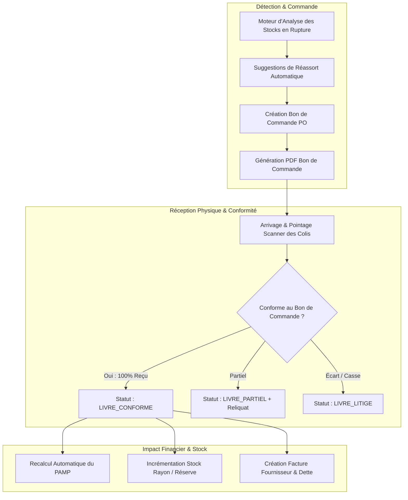

# CAHIER DE CONCEPTION TECHNIQUE : MODULE FOURNISSEURS, APPROVISIONNEMENT & CYCLE D'ACHAT
**Projet :** Iventello Enterprise 2.0  
**Version :** 2.0.0  
**Statut :** Validé / En cours d'implémentation  
**Auteur :** Architecte Logiciel Flutter, Rust & Systèmes Embarqués POS  

---

## 1. VISION & OBJECTIFS DU MODULE FOURNISSEURS

Le module **Fournisseurs & Approvisionnement** d'**Iventello 2.0** automatise la chaîne logistique amont. Il garantit la disponibilité permanente des stocks en rayon tout en optimisant la trésorerie grâce à un réapprovisionnement intelligent basé sur les seuils d'alerte et l'historique d'écoulement.

### Objectifs Clés :
1. **Référentiel Fournisseurs Centralisé :** Contacts, délais de livraison moyens (Lead Time), conditions de paiement négociées (Comptant, 30j, 60j) et catalogue des produits approvisionnés.
2. **Génération Automatisée des Bons de Commande (PO) :**
   * Détection automatique des produits sous le seuil d'alerte (`quantityBoutique <= alertLimit`).
   * Regroupement des besoins par fournisseur et calcul automatique des quantités suggérées de réassort.
   * Génération instantanée de bons de commande PDF A4 professionnels et prêts à l'envoi (Email / WhatsApp).
3. **Réception des Marchandises & Rapprochement 3-Way (Commande vs BL vs Facture) :**
   * Pointage au lecteur code-barres des articles livrés.
   * Détection immédiate des reliquats (livraisons partielles) et des litiges (produits endommagés / manquants).
4. **Calcul Automatique du PAMP (Prix d'Achat Moyen Pondéré) :** Mise à jour en temps réel de la valeur comptable du stock à chaque réception.
5. **Gestion des Dettes & Échéanciers Fournisseurs :** Suivi des factures d'achat impayées, alertes sur échéances et enregistrement des décaissements.

---

## 2. ARCHITECTURE TECHNIQUE DU WORKFLOW D'ACHAT



---

## 3. MODÉLISATION DES DONNÉES (DRIFT SQLITE FFI)

### 3.1. Table des Fournisseurs (`suppliers`)
```dart
import 'package:drift/drift.dart';

class Suppliers extends Table {
  TextColumn get id => text()(); // UUIDv7
  TextColumn get shopId => text().nullable()(); // Rattachement boutique (ou Null = Fournisseur réseau)
  
  // Identité & Coordonnées
  TextColumn get name => text().withLength(min: 1, max: 200)();
  TextColumn get contactPerson => text().nullable()();
  TextColumn get email => text().nullable()();
  TextColumn get phone => text().nullable()();
  TextColumn get address => text().nullable()();
  TextColumn get city => text().nullable()();
  TextColumn get taxNumber => text().nullable()(); // NUI / NIF Fournisseur
  
  // Paramètres Commerciaux & Logistiques
  IntColumn get leadTimeDays => integer().withDefault(const Constant(3))(); // Délai moyen de livraison en jours
  TextColumn get paymentTerms => text().withDefault(const Constant('COMPTANT'))(); // 'COMPTANT' | '30_JOURS' | '60_JOURS'
  TextColumn get bankDetails => text().nullable()(); // IBAN, Coordonnées MoMo Marchand
  
  // Encours Fournisseur (Dettes en Centimes)
  IntColumn get currentDebtCents => integer().withDefault(const Constant(0))();
  IntColumn get totalPurchasesCents => integer().withDefault(const Constant(0))();
  
  TextColumn get notes => text().nullable()();
  BoolColumn get isActive => boolean().withDefault(const Constant(true))();

  // Traçabilité & Sync
  IntColumn get version => integer().withDefault(const Constant(1))();
  DateTimeColumn get createdAt => dateTime().withDefault(currentDateAndTime)();
  DateTimeColumn get updatedAt => dateTime().withDefault(currentDateAndTime)();
  DateTimeColumn get deletedAt => dateTime().nullable()();
  BoolColumn get isDirty => boolean().withDefault(const Constant(false))();

  @override
  Set<Column> get primaryKey => {id};
}
```

### 3.2. Table des Bons de Commande d'Achat (`purchase_orders`)
```dart
class PurchaseOrders extends Table {
  TextColumn get id => text()(); // UUIDv7
  TextColumn get shopId => text()();
  TextColumn get supplierId => text().references(Suppliers, #id)();
  TextColumn get orderNumber => text().customConstraint('UNIQUE')(); // Ex: "BC-2026-0042"
  
  // Statut: 'BROUILLON' | 'ENVOYE' | 'CONFIRME' | 'LIVRE_PARTIEL' | 'LIVRE_CONFORME' | 'LIVRE_LITIGE' | 'ANNULE'
  TextColumn get status => text().withDefault(const Constant('BROUILLON'))();
  
  // Montants Prévisionnels (en centimes)
  IntColumn get totalEstimatedCents => integer().withDefault(const Constant(0))();
  
  TextColumn get pdfPath => text().nullable()();
  TextColumn get notes => text().nullable()();
  
  DateTimeColumn get orderedAt => dateTime().nullable()();
  DateTimeColumn get expectedDeliveryDate => dateTime().nullable()();
  DateTimeColumn get receivedAt => dateTime().nullable()();

  DateTimeColumn get createdAt => dateTime().withDefault(currentDateAndTime)();
  DateTimeColumn get updatedAt => dateTime().withDefault(currentDateAndTime)();
  BoolColumn get isDirty => boolean().withDefault(const Constant(false))();

  @override
  Set<Column> get primaryKey => {id};
}
```

### 3.3. Lignes du Bon de Commande (`purchase_order_items`)
```dart
class PurchaseOrderItems extends Table {
  TextColumn get id => text()(); // UUIDv7
  TextColumn get orderId => text().references(PurchaseOrders, #id, onDelete: KeyAction.cascade)();
  TextColumn get productId => text()();
  
  TextColumn get productName => text()();
  TextColumn get productBarcode => text().nullable()();
  
  IntColumn get quantityOrdered => integer()();
  IntColumn get quantityReceived => integer().withDefault(const Constant(0))();
  IntColumn get unitCostCents => integer()(); // Prix d'achat convenu
  
  // Contexte lors de la commande
  IntColumn get stockAtOrderTime => integer()();
  IntColumn get alertLimitAtOrderTime => integer()();

  @override
  Set<Column> get primaryKey => {id};
}
```

### 3.4. Table des Factures Fournisseurs & Réceptions BL (`supplier_invoices`)
```dart
class SupplierInvoices extends Table {
  TextColumn get id => text()(); // UUIDv7
  TextColumn get shopId => text()();
  TextColumn get supplierId => text().references(Suppliers, #id)();
  TextColumn get purchaseOrderId => text().nullable().references(PurchaseOrders, #id)();
  
  TextColumn get invoiceNumber => text()(); // N° de facture du fournisseur
  TextColumn get deliveryNoteNumber => text().nullable()(); // N° du Bon de Livraison (BL)
  
  // Montants Réels
  IntColumn get subTotalCents => integer()();
  IntColumn get taxTotalCents => integer().withDefault(const Constant(0))();
  IntColumn get finalTotalCents => integer()();
  IntColumn get paidAmountCents => integer().withDefault(const Constant(0))();
  IntColumn get remainingDebtCents => integer()();
  
  // Statut: 'NON_PAYEE' | 'PARTIELLEMENT_PAYEE' | 'SOLDEE'
  TextColumn get paymentStatus => text().withDefault(const Constant('NON_PAYEE'))();
  
  DateTimeColumn get invoiceDate => dateTime()();
  DateTimeColumn get dueDate => dateTime()(); // Date d'échéance de paiement
  
  DateTimeColumn get createdAt => dateTime().withDefault(currentDateAndTime)();
  BoolColumn get isDirty => boolean().withDefault(const Constant(false))();

  @override
  Set<Column> get primaryKey => {id};
}
```

---

## 4. PROCESSUS ET RÈGLES MÉTIER DU CYCLE D'ACHAT

### 4.1. Moteur de Suggestion Automatique de Réapprovisionnement
L'algorithme analyse l'état du stock local pour chaque article associé à un fournisseur :

$$\text{Si } \text{quantityBoutique} + \text{quantityMagasin} \le \text{alertLimit}$$
$$\text{Quantité Suggérée} = (\text{alertLimit} \times 2.5) - (\text{quantityBoutique} + \text{quantityMagasin})$$

Les suggestions sont automatiquement groupées par fournisseur pour permettre l'émission d'un bon de commande global en 1 clic.

### 4.2. Rapprochement à la Réception & Recalcul du PAMP
Lors du pointage du Bon de Livraison (BL) :
1. Pour chaque article livré, si $\text{Quantité Reçue} > 0$ :
   * **Incrémentation du stock physique :** Le stock boutique ou magasin est incrémenté de la quantité reçue.
   * **Calcul du nouveau PAMP :**
     $$\text{PAMP}_{\text{nouveau}} = \frac{(\text{Stock}_{\text{actuel}} \times \text{PAMP}_{\text{actuel}}) + (\text{Quantité}_{\text{reçue}} \times \text{Prix}_{\text{achat\_unitaire}})}{\text{Stock}_{\text{actuel}} + \text{Quantité}_{\text{reçue}}}$$
   * **Création d'un mouvement immuable :** `StockMovement(type: ACHAT_RECEPTION, delta: +Q)`.
2. Si un reliquat existe ($\text{Quantité Reçue} < \text{Quantité Commandée}$), le Bon de Commande passe en statut `LIVRE_PARTIEL` et conserve les lignes en attente.

---

## 5. ERGONOMIE & INTERFACES UTILISATEUR

1. **Tableau de Bord des Approvisionnements :**
   * Indicateurs clés en haut d'écran : Nombre de produits en rupture, Commandes en cours d'acheminement, Dettes fournisseurs à échéance < 7 jours.
2. **Assistant de Commande Fournisseur (Wizard en 3 étapes) :**
   * *Étape 1 :* Liste des articles en alerte pré-cochés avec quantités ajustables.
   * *Étape 2 :* Récapitulatif tarifaire, choix de la date prévisionnelle de livraison et conditions de paiement.
   * *Étape 3 :* Prévisualisation et génération du PDF Bon de Commande avec bouton d'envoi immédiat.
3. **Écran de Réception & Pointage BL :**
   * Mode scan continu au lecteur code-barres pour pointer chaque carton reçu.
   * Comparaison en temps réel colonnes *Commandé* vs *Reçu* avec surlignage vert/orange/rouge.

---

## 6. PROCHAINES ÉTAPES DE DÉVELOPPEMENT

Le cahier de conception du **Module Fournisseurs, Approvisionnement & Cycle d'Achat** est formalisé.  
Le dernier document clé pour compléter l'architecture système globale est :
1. **Module Synchronisation Hybride (Architecture Worker Isolate, Sync Engine Offline/Online, Protocole de communication et Résolution de Conflits)**.
