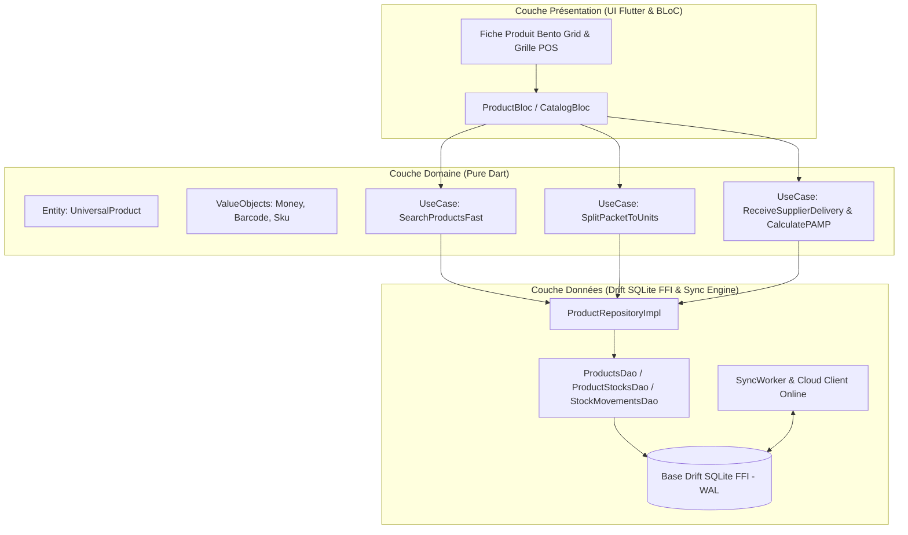

# CAHIER DE CONCEPTION TECHNIQUE : MODULE PRODUITS UNIVERSEL
**Projet :** Iventello Enterprise 2.0  
**Version :** 2.0.0  
**Statut :** Validé / En cours d'implémentation  
**Auteur :** Architecte Logiciel Flutter & Systèmes Embarqués POS  

---

## 1. VISION & OBJECTIFS DU MODULE PRODUITS

Le module Produits de **Iventello 2.0** est un moteur de catalogue **universel, polymorphe et haute performance**. Il s'adapte à n'importe quel secteur d'activité (supermarchés, quincailleries, papeteries/librairies, prêt-à-porter, high-tech, pharmacies) sans modifier le schéma de base de données.

### Objectifs Clés :
1. **Performance d'accès instantanée :** Recherche textuelle et par code-barres en **moins de 10 ms** sur un catalogue de plus de 50 000 références en local.
2. **Polymorphisme Universel :** 10 métadonnées dynamiques configurables par métier (Marque, Modèle, Couleur, Taille, Poids, Lot, Expiration, Garantie, Conditionnement, Note interne).
3. **Double Conditionnement Explicite (Paquet / Détail) :** Vente simultanée au carton/paquet (`quantityBoutique`) et à l'unité détachée (`quantityUnitesDetachees`), avec déconditionnement automatique lors de la vente au détail.
4. **Segmentation Multi-Emplacements :** Gestion compartimentée par boutique du stock en rayon (`quantityBoutique`), du stock en réserve (`quantityMagasin`), des unités détachées (`quantityUnitesDetachees`) et du stock sous acompte (`quantityReservee`).
5. **Synchronisation Hybride Offline-First & Online :** Identifiants UUIDv7 ordonnançables, détection de conflits LWW et propagation temps réel des deltas.

---

## 2. ARCHITECTURE LOGICIELLE DU MODULE



---

## 3. MODÉLISATION DES DONNÉES (DRIFT SQLITE FFI)

### 3.1. Table Principale du Catalogue (`products`)

| Champ | Type SQLite | Description & Règle Métier |
| :--- | :--- | :--- |
| `id` | `TEXT` (UUIDv7) | Clé primaire unique générée localement, ordonnançable chronologiquement. |
| `barcode` | `TEXT` (Unique) | Code-barres EAN-13, UPC, Code 128 ou QR. Indexé pour recherche < 2 ms. |
| `sku` | `TEXT` | Référence article interne / SKU magasin. |
| `name` | `TEXT` | Dénomination commerciale principale du produit (1 à 255 caractères). |
| `base_price_cents` | `INTEGER` | Prix d'achat de référence HT (stocké en centimes entiers). |
| `selling_price_cents`| `INTEGER` | Prix de vente public TTC du paquet ou de l'article standard. |
| `vat_rate` | `REAL` | Taux de TVA applicable en pourcentage (défaut : `19.25%`). |
| `is_packet` | `BOOLEAN` | Indique si le produit est vendu par lot/paquet. |
| `items_per_packet` | `INTEGER` | Nombre d'unités contenues dans un paquet (défaut : `1`). |
| `unit_selling_price_cents` | `INTEGER` (Null) | Prix de vente TTC unitaire si l'article est vendu au détail après déconditionnement. |
| `category_id` | `TEXT` (Null) | Clé étrangère vers la catégorie de classement. |
| `supplier_id` | `TEXT` (Null) | Clé étrangère vers le fournisseur principal pour réassort. |
| `image_url` | `TEXT` (Null) | Chemin d'accès local vers la miniature de l'image. |
| `field1_label` .. `field10_label` | `TEXT` | Noms des 10 attributs personnalisables (Marque, Modèle, Couleur, Taille, etc.). |
| `field1_value` .. `field10_value` | `TEXT` | Valeurs respectives des 10 attributs personnalisables. |
| `version` | `INTEGER` | Numéro de version incrémental pour la résolution de conflits. |
| `updated_at` | `INTEGER` | Timestamp UTC en millisecondes de la dernière modification. |
| `deleted_at` | `INTEGER` (Null) | Marqueur de suppression logique (*soft delete*). |
| `is_dirty` | `BOOLEAN` | `TRUE` si la ligne doit être répliquée vers le serveur central. |

### 3.2. Table des Stocks par Boutique (`product_stocks`)

```dart
class ProductStocks extends Table {
  TextColumn get id => text()(); // UUIDv7
  TextColumn get productId => text().references(Products, #id, onDelete: KeyAction.cascade)();
  TextColumn get shopId => text()(); // ID Boutique / Entrepôt
  
  // Niveaux de Stock Explicites
  IntColumn get quantityBoutique => integer().withDefault(const Constant(0))(); // Paquets ou articles complets en rayon
  IntColumn get quantityMagasin => integer().withDefault(const Constant(0))();  // Paquets en réserve
  IntColumn get quantityUnitesDetachees => integer().withDefault(const Constant(0))(); // Unités individuelles issues du déconditionnement
  IntColumn get quantityReservee => integer().withDefault(const Constant(0))(); // Stock bloqué sous avance/acompte
  
  // Alertes & Emplacement
  IntColumn get alertLimit => integer().withDefault(const Constant(5))();
  TextColumn get shelfLocation => text().nullable()(); // Ex: "Rayon B, Étagère 3"

  // Valeur d'achat moyenne pondérée (PAMP en centimes)
  IntColumn get pampCents => integer().withDefault(const Constant(0))();

  DateTimeColumn get updatedAt => dateTime().withDefault(currentDateAndTime)();
  BoolColumn get isDirty => boolean().withDefault(const Constant(false))();

  @override
  Set<Column> get primaryKey => {id};
  
  @override
  List<Set<Column>> get uniqueKeys => [
    {productId, shopId}
  ];
}
```

### 3.3. Table des Mouvements Immuables (`stock_movements`)

Cette table fonctionne en **Event Sourcing (Append-Only)** :
* `type` de mouvement : `VENTE`, `ACHAT_RECEPTION`, `TRANSFERT_SORTANT`, `TRANSFERT_ENTRANT`, `DECONDITIONNEMENT`, `AJUSTEMENT_INVENTAIRE`, `CASSE_PERTE`, `RETOUR_CLIENT`.
* Enregistre `delta_quantity`, `quantity_before`, `quantity_after`, `unit_cost_cents`, `reference_doc`, `operator_id` et `created_at`.

---

## 4. RÈGLES MÉTIER ET ALGORITHMES DU MODULE

### 4.1. Algorithme de Déconditionnement Automatique (Paquet -> Unités Détachées)
Lorsqu'un caissier vend $N$ unités au détail d'un produit configuré avec `is_packet = true` :

```text
SI stock.quantityUnitesDetachees < quantite_demandee ALORS
    paquets_necessaires = CEIL((quantite_demandee - stock.quantityUnitesDetachees) / product.itemsPerPacket)
    
    SI stock.quantityBoutique >= paquets_necessaires ALORS
        stock.quantityBoutique = stock.quantityBoutique - paquets_necessaires
        stock.quantityUnitesDetachees = stock.quantityUnitesDetachees + (paquets_necessaires * product.itemsPerPacket)
        
        Créer StockMovement(
          type: 'DECONDITIONNEMENT',
          deltaQuantity: -paquets_necessaires,
          notes: 'Éclatement de $paquets_necessaires paquet(s) en ${paquets_necessaires * product.itemsPerPacket} unités'
        )
    SINON
        Lever Exception: "Rupture de stock : pas assez de paquets complets en rayon pour déconditionner."
    FIN SI
FIN SI

// Décrémentation des unités vendues
stock.quantityUnitesDetachees = stock.quantityUnitesDetachees - quantite_demandee
Créer StockMovement(type: 'VENTE', deltaQuantity: -quantite_demandee, notes: 'Vente au détail')
```

### 4.2. Algorithme du Prix d'Achat Moyen Pondéré (PAMP)
Lors de la réception d'une livraison fournisseur (Bon de Livraison) :
$$\text{PAMP}_{\text{nouveau}} = \frac{(\text{Stock}_{\text{actuel}} \times \text{PAMP}_{\text{actuel}}) + (\text{Quantité}_{\text{reçue}} \times \text{Prix}_{\text{achat\_unitaire}})}{\text{Stock}_{\text{actuel}} + \text{Quantité}_{\text{reçue}}}$$

### 4.3. Indexation et Optimisation Requêtes SQLite FFI
```sql
-- Index ultra-rapide pour le scanner de caisse
CREATE UNIQUE INDEX idx_products_barcode ON products(barcode) WHERE deleted_at IS NULL;

-- Index pour la recherche textuelle instantanée
CREATE INDEX idx_products_search ON products(name, sku) WHERE deleted_at IS NULL;

-- Index pour la détection temps réel des ruptures de stock
CREATE INDEX idx_product_stocks_alert ON product_stocks(shop_id, quantity_boutique, alert_limit);
```

---

## 5. REPRÉSENTATION GRAPHIQUE (INTERFACE BENTO ADAPTATIVE)

L'interface de gestion et de saisie des fiches produits adopte une ergonomie moderne de type **Bento Grid** sur 3 colonnes (Desktop) et 1 colonne (Mobile) :

1. **Carte Identité Produit :** Code-barres avec bouton scan continu, Nom commercial, SKU, Catégorie et Fournisseur.
2. **Carte Moteur Tarifaire :** Prix d'achat de base, Prix de vente paquet, Taux de TVA, et calcul automatique de marge brute en direct.
3. **Carte Déconditionnement (Paquet / Détail) :** Switch d'activation, Nombre d'unités par paquet, Prix unitaire détaché et affichage du compteur `quantityUnitesDetachees`.
4. **Carte Multi-Emplacements & Stocks :** Quantité Rayon, Quantité Réserve, Quantité Unités Détachées, Seuil d'alerte et Localisation étagère.
5. **Carte Attributs Universels (10 Champs) :** Formulaire dynamique à 2 colonnes affichant les labels personnalisables et leurs valeurs associées.
6. **Carte Visuel :** Prévisualisation et capture photo locale de l'article.
