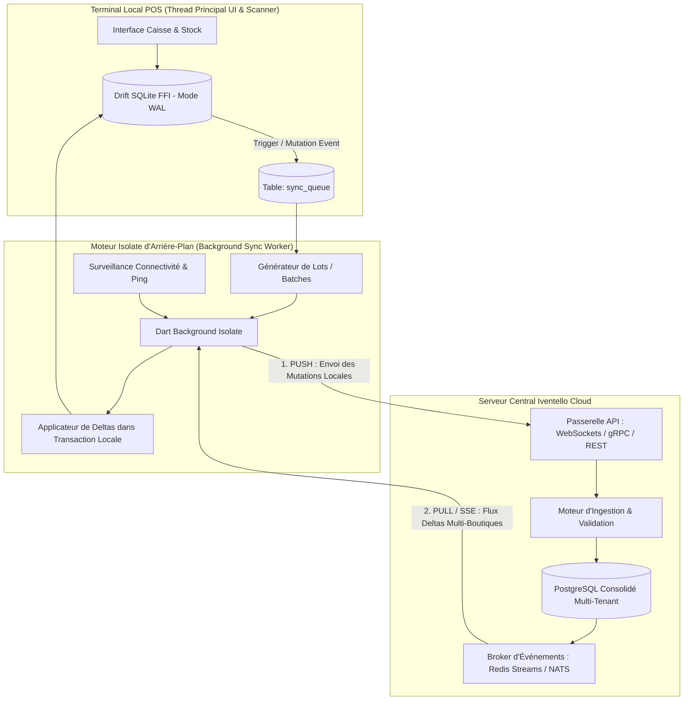

# CAHIER DE CONCEPTION TECHNIQUE : MODULE SYNCHRONISATION HYBRIDE (OFFLINE-FIRST & TEMPS RÉEL)
**Projet :** Iventello Enterprise 2.0  
**Version :** 2.0.0  
**Statut :** Validé / En cours d'implémentation  
**Auteur :** Architecte Logiciel Flutter, Rust & Systèmes Embarqués POS  

---

## 1. VISION & OBJECTIFS DU MOTEUR DE SYNCHRONISATION

Le moteur de synchronisation de **Iventello 2.0** garantit le fonctionnement sans interruption des points de vente dans n'importe quel contexte de connectivité réseau (zones blanches, coupures Internet fréquentes, mobilité en salon/foire), tout en assurant une **convergence instantanée des données multi-boutiques dès que la connexion est active**.

### Objectifs Clés :
1. **Autonomie Locale Totale (Zéro Latence) :** Toutes les opérations (encaissements, scan d'articles, sorties de stock) sont validées localement sur SQLite FFI (mode WAL) en **< 3 ms** sans attendre d'acquittement réseau.
2. **Isolation dans un Worker Dédié (Isolate Dart) :** Le moteur de synchronisation s'exécute dans un thread d'arrière-plan distinct pour ne jamais ralentir le thread UI ou le traitement des entrées matérielles (scanner, imprimante).
3. **Réplication Bidirectionnelle Continue (Push / Pull) :**
   * **Push :** Dépilement automatique des mutations locales empilées dans `sync_queue` par lots de 50 à 100 enregistrements.
   * **Pull :** Réception différentielle des deltas générés par le siège ou les autres boutiques depuis le dernier `last_synced_timestamp`.
4. **Résolution Mathématique des Conflits :** Modèle *Event Sourcing* pour les stocks (échange de deltas relatifs et non de valeurs absolues), *Append-Only* pour les ventes, et *Last-Write-Wins (LWW)* pour le référentiel produit.
5. **Sécurité et Intégrité :** Authentification par jeton terminal (Device Token), chiffrement TLS 1.3 et signature cryptographique HMAC de chaque paquet.

---

## 2. ARCHITECTURE TECHNIQUE DU MOTEUR HYBRIDE



---

## 3. MODÉLISATION DES DONNÉES DE RÉPLICATION (DRIFT SQLITE FFI)

### 3.1. Table de la File d'Attente des Mutations (`sync_queue`)
Enregistre chaque création, modification ou suppression locale en attente d'expédition vers le Cloud.

```dart
import 'package:drift/drift.dart';

class SyncQueue extends Table {
  TextColumn get id => text()(); // UUIDv7
  TextColumn get shopId => text()(); // Boutique émettrice
  
  // Liste exhaustive des tables réplicables dans Iventello 2.0:
  // 'products' | 'product_stocks' | 'shops' | 'company_settings' |
  // 'sales' | 'sale_items' | 'cash_sessions' | 'held_carts' |
  // 'clients' | 'client_payments' |
  // 'suppliers' | 'purchase_orders' | 'purchase_order_items' | 'supplier_invoices' |
  // 'inter_shop_transfers' | 'inter_shop_transfer_items' |
  // 'stock_movements' | 'users' | 'user_shop_assignments' | 'audit_logs'
  TextColumn get tableName => text()();
  
  TextColumn get recordId => text()(); // UUIDv7 de l'enregistrement cible
  
  // Action: 'INSERT' | 'UPDATE' | 'DELETE'
  TextColumn get action => text()();
  
  // Payload JSON complet de la mutation
  TextColumn get payloadJson => text()();
  
  // Statut: 'PENDING' | 'IN_FLIGHT' | 'COMPLETED' | 'FAILED'
  TextColumn get status => text().withDefault(const Constant('PENDING'))();
  
  IntColumn get attempts => integer().withDefault(const Constant(0))();
  TextColumn get lastError => text().nullable()();
  
  DateTimeColumn get createdAt => dateTime().withDefault(currentDateAndTime)();
  DateTimeColumn get processedAt => dateTime().nullable()();

  @override
  Set<Column> get primaryKey => {id};
  
  @override
  List<Set<Column>> get uniqueKeys => [
    {tableName, recordId, action, status}
  ];
}
```

### 3.2. Table des États de Synchronisation (`sync_state`)
Mémorise les pointeurs temporels (curseurs) pour chaque table synchronisée.

```dart
class SyncState extends Table {
  TextColumn get tableName => text()();
  TextColumn get shopId => text()();
  
  // Curseur du dernier événement serveur reçu (Timestamp UTC millisecondes)
  IntColumn get lastSyncedTimestamp => integer().withDefault(const Constant(0))();
  
  // Numéro de séquence ou version serveur
  IntColumn get lastServerVersion => integer().withDefault(const Constant(0))();
  
  DateTimeColumn get lastSyncSuccessAt => dateTime().nullable()();

  @override
  Set<Column> get primaryKey => {tableName, shopId};
}
```

---

## 4. RÈGLES DE RÉSOLUTION MATHÉMATIQUE DES CONFLITS

| Nature de la Donnée | Stratégie Appliquée | Mécanisme de Résolution |
| :--- | :--- | :--- |
| **Ventes & Encaissements (`sales`, `sale_items`)** | **Append-Only (Immuable)** | Aucun conflit possible. Toutes les ventes générées hors-ligne sur différents terminaux sont insérées séquentiellement sans écrasement. |
| **Mouvements & Niveaux de Stock (`product_stocks`)** | **Event Sourcing / Deltas Relatifs** | On ne synchronise jamais une valeur brute (`stock = 15`), mais la variation signée `deltaQuantity` (+5, -2). Le serveur central et les terminaux appliquent la somme des deltas pour recalculer le stock exact. |
| **Catalogue & Tarifs (`products`, `categories`)** | **Last-Write-Wins (LWW) avec Priorité Serveur** | En cas de modification concurrente sur le même produit, la version possédant le timestamp UTC le plus récent (ou la version validée par l'Administrateur central) fait foi. |
| **Fiches Clients & Dettes (`clients`, `client_payments`)** | **Sommation des Règlements** | Les paiements et règlements de dettes sont des événements additifs (*Append-Only*). Le solde de la dette est recalculé par soustraction des paiements validés. |
| **Inventaires Physiques (`physical_inventories`)** | **Point d'Ancrage Temporel (Snapshot)** | La validation d'une session d'inventaire fixe une nouvelle base de référence à une date $T_0$, écrasant les deltas antérieurs tout en conservant le journal des écarts. |

---

## 5. PROTOCOLE D'ÉCHANGE & WORKFLOW DU SYNC WORKER

### 5.1. Phase 1 : Détection & PUSH (Terminal ➔ Cloud)
1. Le worker d'arrière-plan interroge la table `sync_queue` locale (`WHERE status = 'PENDING' ORDER BY createdAt ASC LIMIT 100`).
2. Les mutations sont marquées temporairement à `IN_FLIGHT`.
3. Le worker expédie le paquet HTTP/2 ou gRPC vers le serveur :
   ```json
   {
     "device_id": "POS-TERMINAL-01",
     "shop_id": "018f2d5a-...",
     "auth_token": "eyJhbGciOi...",
     "batch_id": "018f2d6b-...",
     "mutations": [
       {
         "queue_id": "018f2d7c-...",
         "table": "sales",
         "action": "INSERT",
         "record_id": "018f2d8d-...",
         "timestamp": 1727265000000,
         "data": { ... }
       }
     ]
   }
   ```
4. Dès réception du code `200 OK` avec acquittement des IDs traités, les lignes correspondantes de `sync_queue` passent à `COMPLETED` puis sont purgées.

### 5.2. Phase 2 : PULL & DIFFÉRENTIEL (Cloud ➔ Terminal)
1. Le worker envoie son dernier curseur connu `lastSyncedTimestamp`.
2. Le serveur Cloud retourne la liste ordonnée de tous les événements survenus depuis ce curseur pour la boutique concernée et les données globales (produits, prix).
3. **Application Locale Atomique :** Le worker applique l'ensemble des deltas reçus au sein d'une **transaction SQLite unique** pour préserver la cohérence référentielle.
4. Mise à jour de la table `sync_state`.

---

## 6. SÉCURITÉ & ROBUSTESSE EN ENVIRONNEMENT CONTRAINT

1. **Gestion de l'Instabilité Réseau (Backoff Exponentiel) :**
   En cas d'échec de communication (timeout, erreur 503), le worker applique une pause exponentielle avec gigue aléatoire :
   $$T_{\text{pause}} = \min(2^{\text{attempts}} \times 1\text{s} + \text{jitter}, 60\text{s})$$
2. **Empreinte Mémoire & Batterie Minimale :**
   * Pause automatique du polling intensif lorsque l'application est en veille.
   * Utilisation de WebSockets légers / SSE en mode connecté pour éviter le polling inutile.
3. **Chiffrement & Signature :**
   * Connexions sécurisées TLS 1.3 avec épinglage de certificat (*Certificate Pinning*).
   * Horodatage UTC synchronisé via protocole NTP pour éviter tout décalage d'horloge locale sur les terminaux de caisse.
