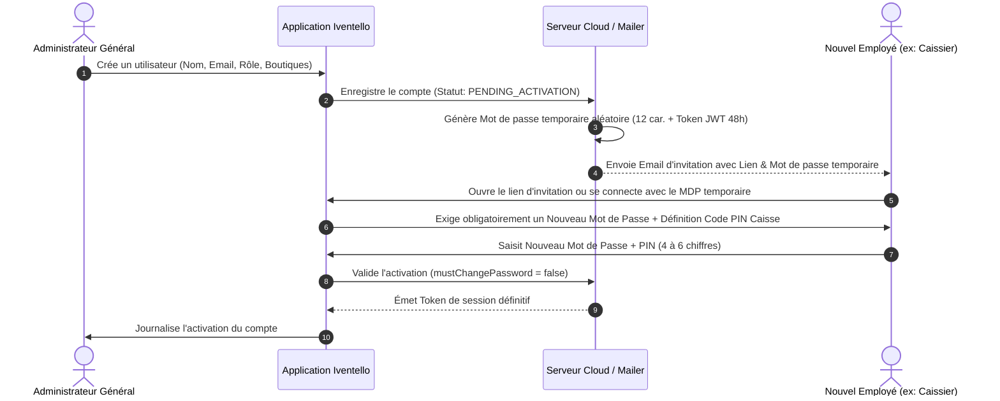

# CAHIER DE CONCEPTION TECHNIQUE : MODULE UTILISATEURS, RÔLES (RBAC) & JOURNAL D'AUDIT
**Projet :** Iventello Enterprise 2.0  
**Version :** 2.0.0  
**Statut :** Validé / En cours d'implémentation  
**Auteur :** Architecte Logiciel Flutter, Rust & Systèmes Embarqués POS  

---

## 1. VISION & OBJECTIFS DU MODULE UTILISATEURS & AUDIT

Le module **Utilisateurs, Sécurité & Traçabilité** de **Iventello 2.0** garantit l'intégrité opérationnelle, la responsabilisation des collaborateurs et la protection contre la fraude interne.

### Objectifs Clés :
1. **Gestion des Rôles & Permissions Granulaires (RBAC Multi-Boutiques) :** Attribution de droits d'accès contextualisés par site (Super Administrateur, Gérant de Boutique, Chef de Rayon, Caissier, Agent Commercial).
2. **Onboarding Sécurisé & Invitation par Email :**
   * Création de compte par l'administrateur avec génération d'un mot de passe temporaire aléatoire fort.
   * Envoi automatique d'un email d'invitation contenant le lien d'activation sécurisé (Token temporaire).
   * **Obligation de renouvellement du mot de passe** à la première connexion et configuration d'un **Code PIN à 4 ou 6 chiffres** pour le déverrouillage rapide de caisse.
3. **Changement Rapide d'Opérateur & Validation Superviseur par PIN :** Bascule instantanée entre caissiers sur un même poste et déblocage à la volée des actions restreintes (remise > seuil, annulation de ticket, ouverture tiroir sans vente).
4. **Journal d'Audit Immuable (« Qui a fait Quoi, Quand, Où, Pourquoi ») :** Enregistrement non modifiable de chaque événement sensible avec l'ancienne et la nouvelle valeur, l'opérateur, et le superviseur ayant validé.

---

## 2. MATRICE DES RÔLES ET DES PERMISSIONS

| Fonctionnalité / Action Sensible | Caissier | Chef de Rayon | Gérant de Boutique | Administrateur Général (DG) |
| :--- | :---: | :---: | :---: | :---: |
| **Encaisser une vente standard** | ✅ Oui | ✅ Oui | ✅ Oui | ✅ Oui |
| **Appliquer une remise normale (≤ seuil max)**| ✅ Oui | ✅ Oui | ✅ Oui | ✅ Oui |
| **Appliquer une remise exceptionnelle (> seuil)**| 🔒 PIN Gérant requis | 🔒 PIN Gérant requis | ✅ Oui | ✅ Oui |
| **Annuler une ligne de panier ou un ticket** | 🔒 PIN Gérant requis | 🔒 PIN Gérant requis | ✅ Oui | ✅ Oui |
| **Ouvrir le tiroir-caisse manuellement (hors vente)**| 🔒 PIN Gérant requis | 🔒 PIN Gérant requis | ✅ Oui | ✅ Oui |
| **Saisir un inventaire physique** | ❌ Non | ✅ Oui | ✅ Oui | ✅ Oui |
| **Valider les écarts d'inventaire (pertes/gains)** | ❌ Non | ❌ Non | ✅ Oui | ✅ Oui |
| **Émettre une expédition inter-boutique** | ❌ Non | ✅ Oui | ✅ Oui | ✅ Oui |
| **Réceptionner et pointer un transfert** | ❌ Non | ✅ Oui | ✅ Oui | ✅ Oui |
| **Consulter le chiffre d'affaires du jour (Rapport X)**| ✅ Oui | ✅ Oui | ✅ Oui | ✅ Oui |
| **Clôturer la caisse (Rapport Z)** | ✅ Oui | ✅ Oui | ✅ Oui | ✅ Oui |
| **Consulter les rapports financiers consolidés** | ❌ Non | ❌ Non | ❌ Non (Local uniquement) | ✅ Oui (Toutes boutiques) |
| **Modifier le prix de vente d'un produit** | ❌ Non | ❌ Non | ❌ Non | ✅ Oui |
| **Créer / Désactiver des comptes utilisateurs** | ❌ Non | ❌ Non | ❌ Non | ✅ Oui |

---

## 3. PROCESSUS D'INVITATION & ACTIVATION PAR EMAIL



---

## 4. MODÉLISATION DES DONNÉES (DRIFT SQLITE FFI)

### 4.1. Table des Utilisateurs (`users`)
```dart
import 'package:drift/drift.dart';

class Users extends Table {
  TextColumn get id => text()(); // UUIDv7
  TextColumn get email => text().withLength(min: 5, max: 200).customConstraint('UNIQUE')();
  TextColumn get passwordHash => text()(); // Argon2id ou bcrypt
  TextColumn get pinCodeHash => text().nullable()(); // Hash du PIN de caisse
  
  // Identité & Contact
  TextColumn get firstName => text().withLength(min: 1, max: 100)();
  TextColumn get lastName => text().withLength(min: 1, max: 100)();
  TextColumn get phone => text().nullable()();
  TextColumn get avatarUrl => text().nullable()();
  
  // Rôle Global: 'SUPER_ADMIN' | 'GERANT' | 'CHEF_RAYON' | 'CAISSIER' | 'AGENT_COMMERCIAL'
  TextColumn get globalRole => text().withDefault(const Constant('CAISSIER'))();
  
  // Rémunération / Commission (pour agents commerciaux)
  RealColumn get commissionRatePercent => real().withDefault(const Constant(0.0))();
  
  // Statuts de Sécurité
  BoolColumn get isActive => boolean().withDefault(const Constant(true))();
  BoolColumn get mustChangePassword => boolean().withDefault(const Constant(true))();
  DateTimeColumn get lastLoginAt => dateTime().nullable()();

  // Traçabilité & Sync
  IntColumn get version => integer().withDefault(const Constant(1))();
  DateTimeColumn get createdAt => dateTime().withDefault(currentDateAndTime)();
  DateTimeColumn get updatedAt => dateTime().withDefault(currentDateAndTime)();
  DateTimeColumn get deletedAt => dateTime().nullable()();
  BoolColumn get isDirty => boolean().withDefault(const Constant(false))();

  @override
  Set<Column> get primaryKey => {id};
}
```

### 4.2. Table du Journal d'Audit Immuable (`audit_logs`)
Enregistre chaque événement critique pour une auditabilité totale et infalsifiable (*Append-Only*).

```dart
class AuditLogs extends Table {
  TextColumn get id => text()(); // UUIDv7
  TextColumn get shopId => text()(); // Boutique où l'action s'est déroulée
  TextColumn get userId => text()(); // Opérateur connecté ayant initié l'action
  TextColumn get supervisorId => text().nullable()(); // Gérant ayant saisi son PIN d'autorisation
  
  // Type d'action:
  // 'CONNEXION' | 'DECONNEXION' | 'OUVERTURE_CAISSE' | 'CLOTURE_CAISSE_Z' |
  // 'VENTE_VALIDEE' | 'VENTE_ANNULEE' | 'LIGNE_SUPPRIMEE' | 'REMISE_EXCEPTIONNELLE' |
  // 'TIROIR_OUVERT_MANUEL' | 'PRIX_MODIFIE' | 'TRANSFERT_EMIS' | 'TRANSFERT_RECU' |
  // 'INVENTAIRE_VALIDE' | 'COMPTE_CREE' | 'COMPTE_MODIFIE'
  TextColumn get actionType => text()();
  
  TextColumn get entityTable => text().nullable()(); // Ex: 'sales', 'products', 'cash_sessions'
  TextColumn get entityId => text().nullable()();    // ID de la ressource impactée
  
  // Snapshots JSON avant / après pour traçabilité différentielle
  TextColumn get oldValuesJson => text().nullable()();
  TextColumn get newValuesJson => text().nullable()();
  
  TextColumn get justification => text().nullable()(); // Motif saisi par l'opérateur ou le gérant
  TextColumn get deviceId => text()(); // Identifiant matériel du terminal POS
  
  DateTimeColumn get createdAt => dateTime().withDefault(currentDateAndTime)();
  BoolColumn get isDirty => boolean().withDefault(const Constant(false))();

  @override
  Set<Column> get primaryKey => {id};
}
```

---

## 5. RÈGLES DE SÉCURITÉ ET WORKFLOW D'AUTORISATION À LA VOLÉE

### 5.1. Déverrouillage Rapide & Alternance d'Opérateurs (Lock Screen POS)
1. Lorsque la caisse est inactive plus de $N$ minutes ou que le caissier clique sur « Verrouiller », l'écran affiche un pavé numérique tactile.
2. Le caissier saisit son **Code PIN à 4 ou 6 chiffres** (< 1 seconde).
3. La session est immédiatement réactivée avec son nom et ses permissions propres sans recharger toute l'application.

### 5.2. Autorisation Superviseur par PIN à la Volée
Lorsqu'un caissier tente une action nécessitant une dérogation (ex: remise de 15% alors que son plafond est de 5%) :

```text
1. L'application bloque l'action et affiche la fenêtre modale :
   « Autorisation Superviseur Requise : Remise de 15% sur Article X »
2. Le Gérant de Boutique s'approche et saisit son Code PIN Superviseur.
3. Le système vérifie les droits du superviseur pour cette boutique.
4. Si valide :
   - L'action est exécutée sur la session du caissier.
   - Un enregistrement est créé immédiatement dans AuditLogs :
     AuditLog(
       actionType: 'REMISE_EXCEPTIONNELLE',
       userId: caissier.id,
       supervisorId: gerant.id,
       justification: 'Remise commerciale accordée par le gérant',
       oldValuesJson: '{"discount": 0}',
       newValuesJson: '{"discount": 15}'
     )
5. La session du caissier reste active sans déconnexion.
```

---

## 6. TABLEAU DE BORD DE L'AUDIT POUR L'ADMINISTRATEUR

Dans l'interface d'administration centrale, une vue dédiée **« Journal d'Audit & Sécurité »** permet de :
* Filtrer chronologiquement par boutique, par caissier, par superviseur ou par type d'événement.
* Visualiser les alertes d'anomalies (ex: *« 5 ouvertures de tiroir sans vente consécutives sur la Caisse 2 »*, *« 3 annulations de ticket après encaissement »*).
* Exporter les journaux d'audit certifiés en PDF ou tableur pour les contrôles comptables et fiscaux.
