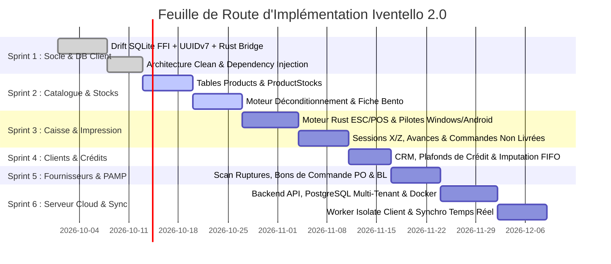

# PRODUCT BACKLOG & FEUILLE DE ROUTE : IVENTELLO ENTERPRISE 2.0
**Projet :** Iventello Enterprise 2.0 (App Client Native Flutter + Backend Cloud)  
**Méthodologie :** Agile / Clean Architecture  
**Priorisation :** P0 (Bloquant / Socle) ➔ P1 (Opérationnel Caisse) ➔ P2 (Gestion Avancée) ➔ P3 (Cloud Sync & Serveur Central)  

---

## 🗺️ VUE D'ENSEMBLE DES SPRINTS (CLIENT & SERVEUR)

---

## SPRINT 1 : SOCLE FONDAMENTAL CLIENT, BASE DE DONNÉES & PONT RUST (P0 - CRITIQUE)
**Objectif :** Poser la structure technique compilable multiplateforme avec accès SQLite FFI ultra-rapide.

| User Story / Tâche | Description Technique | Priorité |
| :--- | :--- | :---: |
| **US-1.1 : Setup Drift FFI & WAL** | Initialisation de la base Drift native avec pragmas de performance (`WAL`, `cache_size`, `busy_timeout`) et support UUIDv7. | **P0** |
| **US-1.2 : Pont Natif Rust v2** | Configuration de `flutter_rust_bridge` (v2), génération des bindings Dart <-> Rust et compilation des librairies partagées (`.dll`, `.so`, `.dylib`). | **P0** |
| **US-1.3 : Architecture BLoC & DI** | Mise en place de l'injection de dépendances (`RepositoryProvider`), gestion des thèmes et structure Clean Architecture. | **P0** |
| **US-1.4 : Module Authentification & PIN** | Écran de connexion, déverrouillage rapide par Code PIN et table `users` + `user_shop_assignments`. | **P0** |

---

## SPRINT 2 : CATALOGUE PRODUITS UNIVERSEL & GESTION MULTI-STOCKS (P0 - CRITIQUE)
**Objectif :** Créer le moteur de catalogue capable de gérer 50 000 références avec recherche < 10 ms.

| User Story / Tâche | Description Technique | Priorité |
| :--- | :--- | :---: |
| **US-2.1 : Schéma Drift Produits & Stocks** | Tables `products`, `product_stocks` (avec `quantityUnitesDetachees`) et index composites FTS5. | **P0** |
| **US-2.2 : Fiche Produit Bento Grid** | Interface adaptative (Desktop/Mobile) avec les 10 attributs personnalisables, gestion des photos et TVA. | **P0** |
| **US-2.3 : Moteur de Déconditionnement** | Logique métier d'éclatement automatique des cartons en unités individuelles lors de la vente. | **P0** |
| **US-2.4 : Topologie des Magasins** | Assistant d'onboarding permettant de choisir : Magasin par boutique, Magasin centralisé ou Hybride. | **P1** |

---

## SPRINT 3 : POINT DE VENTE (POS), MATÉRIEL & IMPRESSION NATIVE (P0 - CRITIQUE)
**Objectif :** Fournir l'écran de caisse complet, ultra-fluide avec impression thermique ESC/POS sans pilote OS.

| User Story / Tâche | Description Technique | Priorité |
| :--- | :--- | :---: |
| **US-3.1 : Moteur Rust ESC/POS** | Composition binaire en Rust (formatage, tramage Floyd-Steinberg des logos 1-bit, codes QR/barres, impulsion tiroir-caisse). | **P0** |
| **US-3.2 : Pilotes d'Impression Multi-OS** | Winspool RAW (Windows C++), UsbManager (Android Kotlin), TCP Sockets (Réseau 9100). | **P0** |
| **US-3.3 : Écran de Caisse & Scanner** | Saisie continue sans latence, gestion des remises, multi-paiements (Espèces, MoMo, Carte) et paniers en attente (`held_carts`). | **P0** |
| **US-3.4 : Avances & Commandes Non Livrées** | Réservation physique en `quantityReservee`, acomptes partiels et suivi des arrivages futurs (`deliveryStatus`). | **P1** |
| **US-3.5 : Clôture de Caisse & Sessions (X/Z)** | Comptage physique à l'aveugle, calcul automatique des écarts et impression du Rapport Z. | **P0** |

---

## SPRINT 4 : CLIENTS, CRÉDITS & GRAND LIVRE DES RÈGLEMENTS (P1 - IMPORTANT)
**Objectif :** Fidéliser la clientèle et sécuriser les ventes à terme (crédits).

| User Story / Tâche | Description Technique | Priorité |
| :--- | :--- | :---: |
| **US-4.1 : Annuaire & Fiche 360° Client** | Profils tarifaires automatiques (`STANDARD`, `FIDELE`, `GROSSISTE`, `VIP`) et historique des achats. | **P1** |
| **US-4.2 : Plafonds de Crédit & Validation PIN** | Blocage automatique en caisse en cas de dépassement d'encours avec dérogation par PIN Superviseur. | **P1** |
| **US-4.3 : Imputation FIFO des Remboursements** | Module d'encaissement de créances avec apurement automatique des factures les plus anciennes et émission de reçus de paiement. | **P1** |

---

## SPRINT 5 : FOURNISSEURS, ACHATS & VALORISATION DES STOCKS (P1 - IMPORTANT)
**Objectif :** Automatiser les réapprovisionnements et maîtriser le coût de revient (PAMP).

| User Story / Tâche | Description Technique | Priorité |
| :--- | :--- | :---: |
| **US-5.1 : Scan des Ruptures & Suggestions PO** | Analyse automatique des seuils d'alerte et regroupement des besoins par fournisseur. | **P1** |
| **US-5.2 : Générateur de Bons de Commande PDF** | Émission instantanée de bons de commande A4 prêts à l'envoi par Email / WhatsApp. | **P1** |
| **US-5.3 : Réception BL & Recalcul du PAMP** | Pointage scanner des colis reçus, gestion des reliquats/litiges et mise à jour mathématique de la valorisation du stock. | **P1** |
| **US-5.4 : Transferts Inter-Boutiques** | Workflow à double validation (`BROUILLON` ➔ `EN_TRANSIT` ➔ `RECU_CONFORME` / `RECU_LITIGE`). | **P1** |

---

## SPRINT 6 : SERVEUR CLOUD CENTRAL & SYNCHRONISATION TEMPS RÉEL (P2 - CONSOLIDATION)
**Objectif :** Mise en place du backend serveur Cloud, de l'API d'ingestion et du moteur de réplication client.

| User Story / Tâche | Description Technique | Priorité |
| :--- | :--- | :---: |
| **US-6.1 : Backend Serveur Cloud & PostgreSQL** | API REST/gRPC d'ingestion, base PostgreSQL Multi-Tenant, tables miroirs et conteneurisation Docker. | **P2** |
| **US-6.2 : Service d'Invitation & Mailer** | Génération de mots de passe temporaires aléatoires et envoi automatique d'emails d'invitation avec token d'activation. | **P2** |
| **US-6.3 : Sync Worker Isolate Client** | Dépilement de `sync_queue`, gestion du Push/Pull par lots et résolution de conflits (Event Sourcing). | **P2** |
| **US-6.4 : Journal d'Audit Immuable** | Table `audit_logs` locale et réplication vers `server_event_log` pour traçabilité anti-fraude globale. | **P2** |
| **US-6.5 : Dashboard Web Direction (Cloud)** | Interface web responsive pour la Direction Générale (CA consolidé réseau, marges, alertes stock multi-boutiques). | **P2** |
